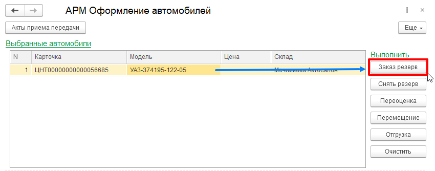

---
title: "Оформление заказа клиента и резервирование автомобиля в 1С ERP"
---

Для продажи автомобиля необходимо оформить "Заказ клиента".

Оформление заказа клиента (покупателя) и резервирование автомобиля осуществляется с помощью обработки «АРМ оформления автомобилей». В окне «Выбранные автомобили» помещается необходимый автомобиль, в блоке «Выполнить» выбирается и нажимается кнопка «Заказ резерв». После чего на экране появляется документ «Заказ клиента» для заполнения.

В табличную часть документа «Заказ клиента» в автоматическом режиме помещаются выбранные в АРМе автомобили с количеством и ценой, складом размещения. 

После выбора клиента из списка контрагентов, необходимо также выбрать или создать "Соглашение об условиях продаж", которое может быть с договором, либо без договора.
При выборе соглашения с договором, необходимо создать договор

В наименовании указываем "Договор купли-продажи" и фиксируем дату регистрации договора.

Во вкладке "Расчеты и оформление" детализация расчетов - "По заказам"

После записи договора проводим документ. Выбранный автомобиль будет зарезервирован под заказ клиента

