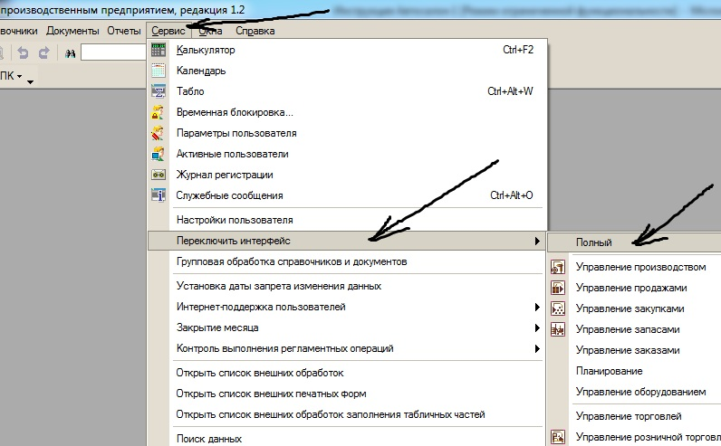
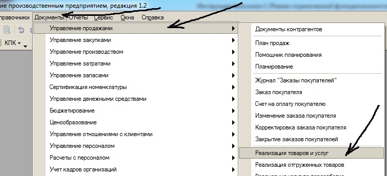
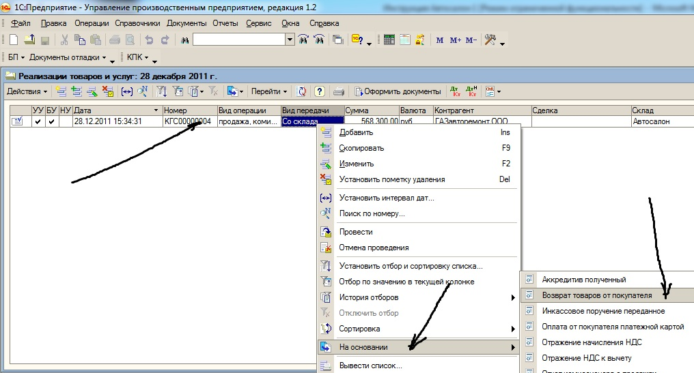
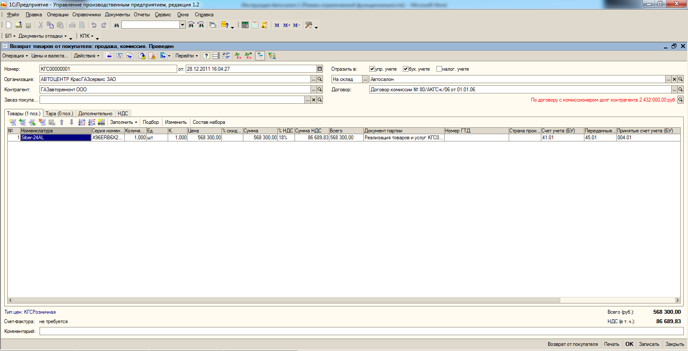
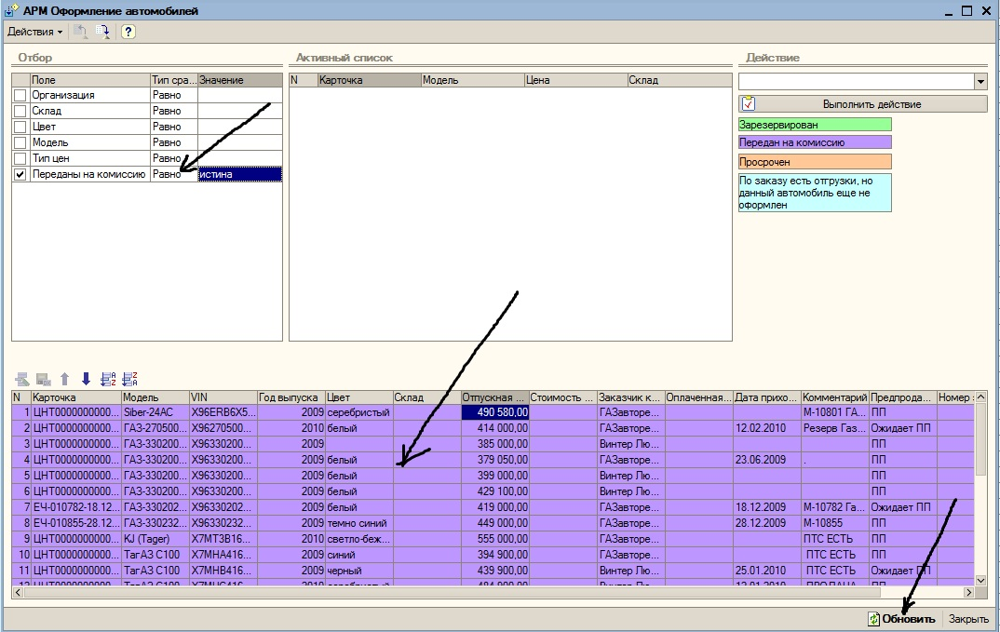
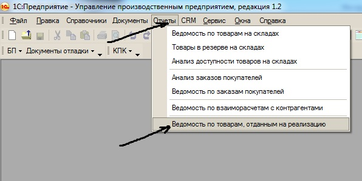

Возврат комиссионных автомобилей производится с помощью документа «Возврат товаров от покупателя», который оформляется на основании документа «Реализация товаров и услуг» (по которому автомобиль был передан комиссионеру). Первым делом необходимо найти документ «Реализация товаров и услуг» для чего необходимо выключить интерфейс «Полный» последовательно выбирая кнопки «Сервис», «Переключить интерфейс», «Полный» (рисунок 82).

Рисунок 82. Кнопки «Сервис», «Переключить интерфейс», «Полный»

После переключения интерфейса необходимо использовать кнопки «Документы», «Управление продажами», «Реализация товаров и услуг» (рисунок 83).

Рисунок 83. Кнопки «Документы», «Управление продажами», «Реализация товаров и услуг»

Далее в открывшемся списке документов реализации товаров работ и услуг необходимо выбрать нужный, активизировать его курсором и с помощью правой кнопки «мыши» ввести на основании документа «Реализация товаров и услуг» документ «Возврат товаров от покупателя» с помощью кнопок «На основании» и «Возврат товаров от покупателя» (рисунок 84).

Рисунок 84. Кнопки «На основании» и «Возврат товаров от покупателя»

После проведения открывшегося документа «Возврат товаров от покупателя» (рисунок 85) в строке АРМа оформление автомобиля по ранее переданному на комиссию автомобилю исчезает фиолетовый цвет.

Рисунок 85. Документ «Возврат товаров от покупателя»

Для отслеживания автомобилей переданных на комиссию применяются следующие возможности. В АРМе оформление автомобилей возможна настройка позволяющая вывести только автомобили переданные на комиссию (Рисунок 86). Рядом с полем «Переданы на комиссию» устанавливается «флаг», выбирается «Тип сравнения» - «Равно», выбирается значение «истина», после нажатие на кнопку «Обновить» в АРМе остаются только автомобили переданные на комиссию (окраска фиолетовым цветом).

Рисунок 86. Отбор автомобилей переданных на комиссию в АРМе оформления автомобилей

Вторым вариантом отслеживания автомобилей переданных на комиссию является использование отчёта «Ведомость по товарам, отданным на реализацию». Запуск отчёта производится при последовательном нажатии кнопок «Отчёты» и «Ведомость по товарам, отданным на реализацию» (рисунок 87).

Рисунок 87. Кнопки «Отчёты» и «Ведомость по товарам, отданным на реализацию»