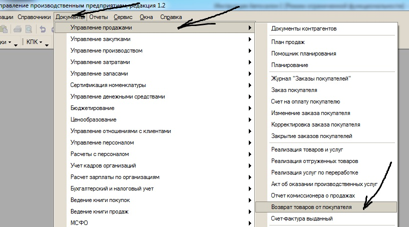
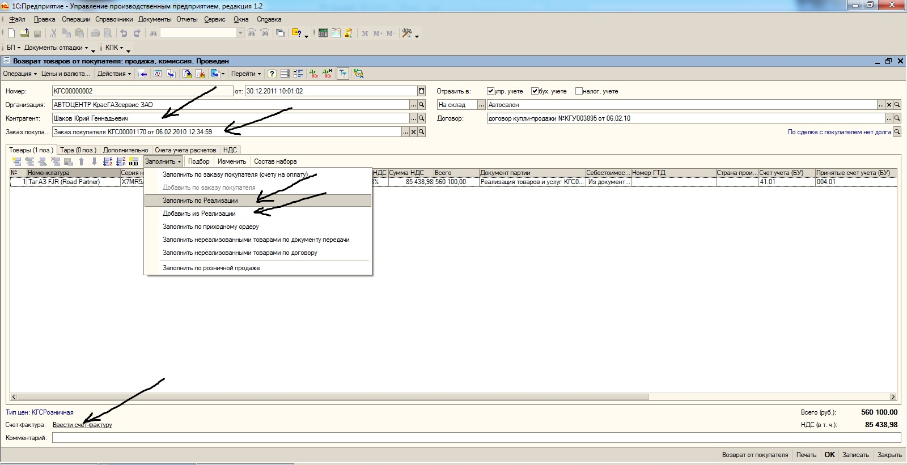
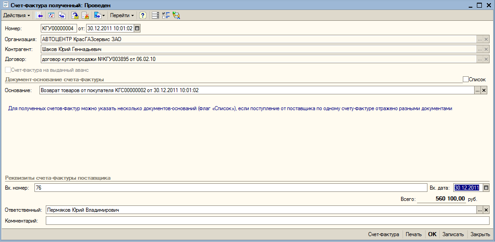
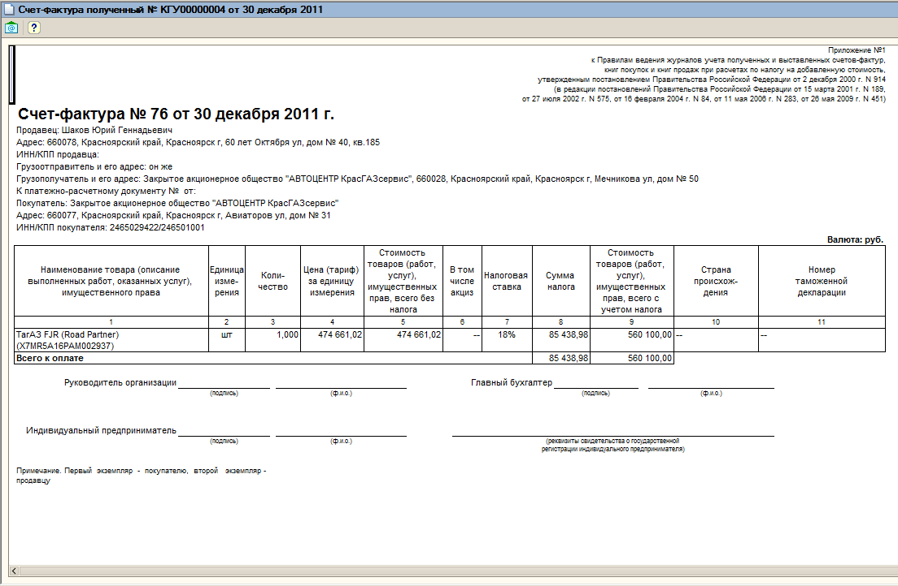

Возврат автомобиля от покупателя регистрируется в информационной системе с использованием документа «Возврат товаров от покупателя». Открытие документа производится из полного интерфейса с помощью кнопок «Документы», «Управление продажами», «Возврат товаров от покупателя» (рисунок 117).

Рисунок 117. Кнопки «Документы», «Управление продажами», «Возврат товаров от покупателя»

На рисунке 118 представлен внешний вид документа «Возврат товаров от покупателя». В поле «Контрагент» вносятся данные покупателя, в поле «Заказ покупателя» выбирается необходимый заказ, подбор автомобиля в табличную часть удобно проводить с помощью кнопок «Заполнить», «Заполнить по поступлению», «Заполнить по реализации». С помощью кнопки «Ввести счёт-фактуру» регистрируется документ «Счёт-фактура полученный» (рисунок 119).

Рисунок 118. Документ «Возврат товаров от покупателя»

Рисунок 119. Документ «Счёт-фактура полученный»

Печатная форма счёта-фактуры распечатывается с помощью кнопки «Печать» (рисунок 120).

Рисунок 120. Печатная форма счёта-фактуры