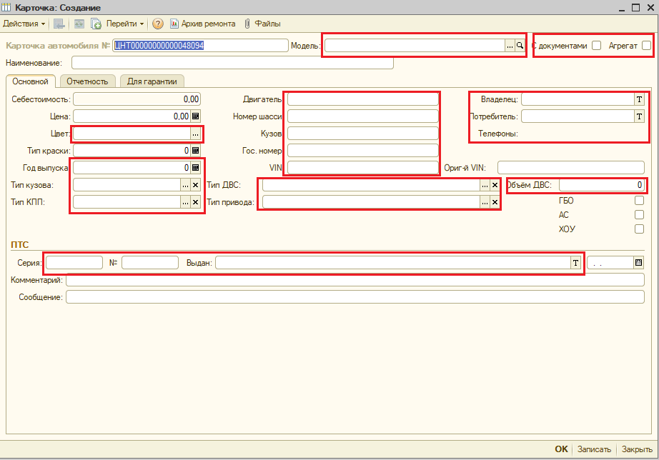

# В3.2.2.2.4. Встреча клиента.

-   При появлении клиента в салоне, сотрудники отдела «Приемка автомобилей в ремонт» приветствуют его первыми, уточняют цель прибытия:  
-   Если визит клиента связан с записью на сервис, работники отдела «приемка автомобилей в ремонт» направляют клиента к Администратору сервиса, администратор сервиса действует по инструкции В.3.2.2.1.
-   Если визит клиента связан со сдачей своего автомобиля в ремонт, выясняют: номер автомобиля, время, на которое был записан клиент:
-   Приглашают клиента к МК к которому была сделана запись.
-   В случае если время сдачи в ремонт еще не наступило, при этом мастер-консультант работает с другим клиентом, вежливо приглашают клиента в зону ожидания, при наступлении запланированного времени, приглашают клиента для оформления автомобиля в ремонт.
-   В случае если запланированное время визита наступило или прошло, при этом клиент приехал своевременно, а мастер-консультант занят работой с другим клиентом, вежливо извиняемся и просим клиента подождать в зоне ожидания клиентов.
-   В случае если клиент опоздал, при этом мастер-консультант занят работой с другим клиентом, вежливо сообщаем о том, что клиент не прибыл к запланированному времени, и сейчас мастер-консультант принимает в ремонт автомобиль, своевременно прибывшего клиента, приглашаем клиента в зону ожидания клиентов, затем в момент появления возможности принять его автомобиль в ремонт приглашаем на оформление документов.
-   В случае если клиент не записан в сервис, при этом он обращается с проблемой связанной с невозможностью эксплуатировать автомобиль, автомобиль доставили на автоэвакуаторе, клиент доставил автомобиль и сообщает о повторении проблемы, с которой он обращался ранее, МК принимает автомобиль, по мере возможности, при этом не в ущерб времени клиентов, которые приехали по записи. До момента начала приема автомобилей в ремонт приглашает клиентов, прибывших в сервис вне очереди, ожидать в зоне ожидания клиентов.
-   Мастер-консультант встречается с клиентом, представляется, просит предоставить ему документы, удостоверяющие личность клиента, свидетельство о регистрации ТС, в случае если автомобиль принадлежит юридическому лицу, см инст. Такую то, ее еще нет.
-   Идентифицирует автомобиль в записи предприятия, актуализирует контактные данные клиента в БД 1С УПП, проверяет правильность заполнения карточки автомобиля и клиента, при необходимости корректирует. В.3.2.2.1 Рис. 6-7
-   Переводит электронную заявку записи в статус предварительной заявки, Рис.14.

Рис.14. Окно «График» вкладка «Поиск»

Во вкладке «Поиск» вносим номер автомобиля в поле «номер» затем нажимаем кнопку поиск,

После этого в нижнем окне появится результат поиска записи. Рис.15.

Рис.15. Вкладка «Поиск»

Двойным щелчком в выделенном поле Рис.15 открываем окно «ремонты, карточка записи»

Рис.16. Окно «Ремонты» карточка записи.

В случае, если карточка записи не заполнена, как указанно на Рис.16. необходимо проверить имеется ли БД 1С УПП карточка автомобиля, для этого нажимаем на кнопку «…» 

Рис.17 Окно «Ремонты» карточка записи

Открывается окно «Справочник карточка»

Рис.18. Окно «Справочник карточка»

Отключаем иерархию как указанно на Рис.18. затем нажимаем кнопку «поиск» Рис.19.

Рис.19. Окно «Справочник карточка»

Открывается окно «Отбор и сортировка» Рис.20.

Рис.20. Окно «Отбор и сортировка»

В выделенном поле вносим VIN номер с СТС клиента, затем в том же окне нажимаем «ок» Рис. 20, в случае если карточка с искомым вином имеется в БД 1С УПП, появится поле с результатами поиска Рис.21.

Рис.21. Окно «справочник карточка»

Двойным щелчком в указанное поле Рис.21 открываем карточку автомобиля

Рис.22. Окно «Карточка автомобиля»

Вносим государственный номер автомобиля. Рис.21. Затем необходимо сверить с СТС данные по владельцу и контактный номер телефона. Затем нажимаем «ок»

В случае, если карточка автомобиля отсутствует в БД 1С УПП, возвращаемся в окно, «Справочник карточка» Рис.17. создаем новую карточку. Рис.23.

Рис.23. Окно «Справочник карточка»

В окне «Справочник карточка» нажимаем «**+**» Рис.23. Открывается окно «Карточка создание» Рис.24.

Рис.24 Окно «Карточка создание»

Заполняем выделенные поля, необходимые данные для заполнения берем из СТС и ПТС клиента, после заполнения, нажимаем «ок»

Возвращаемся в окно ремонты, вновь вводим номер автомобиля, автоматически заполняются необходимые поля карточки записи.

Выясняем цель визита клиента, в случае наличия жалоб собираем дополнительную информацию, не менее пяти уточняющих вопросов, что, где, когда, после чего началось, неисправность проявляется постоянно, при какой температуре воздуха. На прогретом двигателе или нет итд. заносит её в электронную форму предварительной заявки, принимает решение о необходимости проведения тестовой поездки с клиентом для демонстрации беспокоящих клиента проблем.
