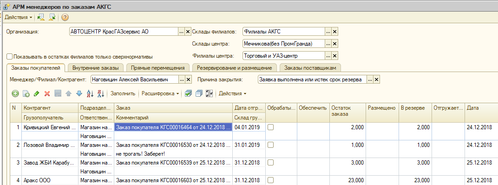
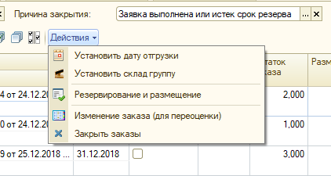

**Для того что бы товар не «зависал» в резерве, необходимо максимум 1 раз в месяц проверять актуальность созданных Вами заказов покупателей , и при необходимости закрывать их.**

Для этого необходимо открыть: Сервис →Дополнительные внешние отчеты и обработки →Обработки →Торговря →АРМ менеджеров по заказам АКГС. Заполнить поля как показано в «скрине», с учетом вашего подразделения и нажать «заполнить».

После вывода информации, необходимо проверить счета с превышением 5 (рабочих дней), от даты проверки, на предмет их оплаты. Для этого необходимо направить курсор в поле «Комментарий» где указан заказ покупателя, и двойным щелчком левой кнопки мыши открыть необходимый счет для просмотра.

Далее прверяем остаток денег по данному счету у контрагента, если сумма недостаточна, ставим галочку в поле «обрабатывать».

После проверки всех счетов и проставления галочек, набираем: Действия→ Закрыть заказы → Ок.

