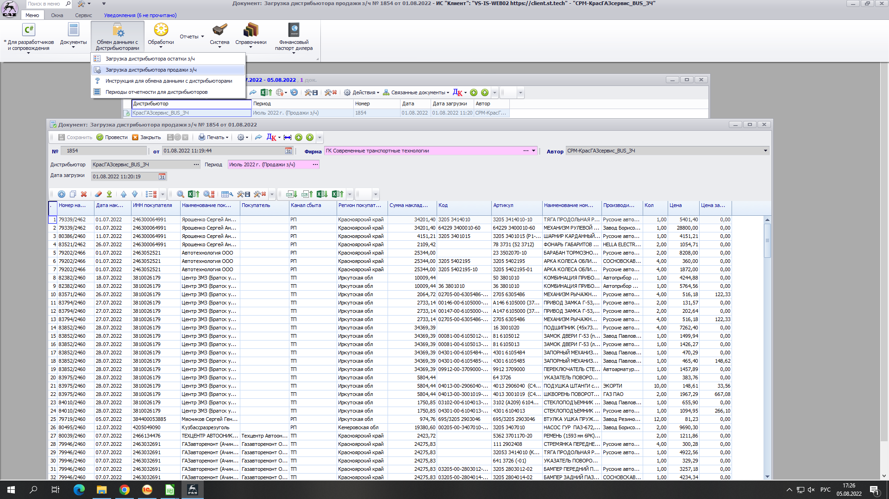
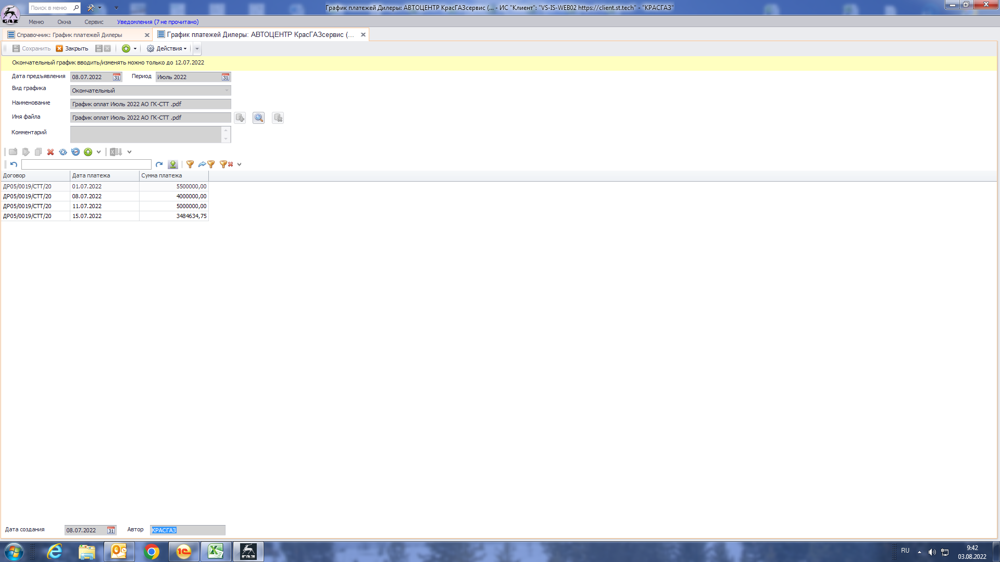

# Закупки продукции бренда ПАЗ

1. Подготовительные работы. Каждый месяц до 3-го числа в систему "ИС клиент" необходимо загрузить данные по остаткам и продажам.
2. Выгрузка данных по продажам выполняется обработкой "***Выгрузка продаж дистрибьютора автобусы***". Настройки обработки:
	1. Период = Конец месяца
	2. Организация = АВТОЦЕНТР КрасГАЗсервис (000000002)
	3. Коммерческие автомобили группа ГАЗ = Русские автобусы -Группа ГАЗ (МЕЧ-00010782)
	4. Кнопка "Заполнить", затем загадочное действие с очисткой табличной части (возможно изменились требования к отчётности). 
	5. Кнопка "Выполнить". Формируются два файла salesdealer.xml и [архив с тем же файлом](_attach/salesdealer.zip), который загружается в систему "ИС клиент".
3. Загрузка данных по продажам в систему "ИС Клиент"  выбирается именно zip файл.
4. Выгрузка данных по остаткам выполняется обработкой "***Выгрузка остатков номенклатуры в XML с 20170601***". Настройки обработки:
	1. Дата выгрузки = Первый день следующего месяца
	2. Цифровой идентификатор организации = 10313
	3. Тип цен = КГСЗакупочная
	4. Склад в группе Автоцентр КрасГАЗсервис
	5. Номенклатура.ОсновнойПоставщик = Русские автобусы -Группа ГАЗ (МЕЧ-00010782)
	6. Кнопка "Сформировать". Формируются два файла remaindersdealer.xml и [архив с тем же файлом](_attach/remaindersdealer.zip), который загружается в систему "ИС клиент".
5. Заявка на закупку запасных частей подготавливается в 20-х числах месяца. 
6. Вся работа по подготовке заявки выполняется в файле шаблона [01 ШАБЛОН ДИЛЕРАМ ПАЗ](_attach/01_ШАБЛОН_ДИЛЕРАМ_ПАЗ.xlsx), который присылает поставщик.
7. Если у позиции нет цены, значит она не доступна для заказа.
8. Соответсвие между номенклатурой 1С и файлом шаблона выполнено с помощью значений реквизита "Заводской номер", но не все позиции.
9. Заполнение колонки заказ происходит вручную, данные для принятия решения о заказе сотрудник отдела снабжения получает из отчёта "***Снабженческий анализ для заказа***". Настройки отчета: 
	1. Номенклатура.ОсновнойПоставщик = Русские автобусы -Группа ГАЗ (МЕЧ-00010782)
	2. Номенклатура в группе 05 ПАЗ (000002541)
	3. Период выбираем последние полгода
	4. Дата - завтра
	5. Группировка строк - Номенклатура, Склад
10. Сотрудник отдела снабжения анализирует данные отчёта и данные двух предыдущих файлов [01 ШАБЛОН ДИЛЕРАМ ПАЗ](_attach/01_ШАБЛОН_ДИЛЕРАМ_ПАЗ.xlsx) за предыдущие месяцы.
11. После обработки информации файл сохраняется. Данный файл отправляется по электронной почте. 
12. ГАЗ ("Группа ГАЗ" включает в себя направление "Русские автобусы" в которое входит "Павловский автобусный завод") присылает нам файл [03 Приложение к договору ПАЗ.xlsx](_attach/03_Приложение_к_договору_ГАЗ.xlsx) для подтверждения с нашей стороны. Данное приложение точно такое же как у ГАЗ. Если в файле, что-то не так, то пишется ответное письмо в котором указывается, что именно не соответствует заявке. ГАЗ присылает исправленный файл. Файл распечатывается, подписывается, ставится печать, сканируется и отправляется ответным письмом. Гарантия выполнения отгрузки по подтверждённому приложению 90-95%.
13. Сотрудниками отдела снабжения создаётся [04 График платежей ГАЗ.xlsx](_attach/04_График_платежей_ГАЗ.xlsx) в одном из двух случаев (в зависимости от того что наступит раньше):   
	1. Звонок с ГАЗа с сообщением, что все приложения обработаны и больше не будет.   
	2. Наступило 10 число месяца.
14. Файл [04 График платежей ГАЗ.xlsx](_attach/04_График_платежей_ГАЗ.xlsx) график отправлется по электронной почте.
15. После небольшого изменения получается файл [05 Передача данных по оплате в ГАЗ клиент.xlsx](_attach/05_Передача_данных_по_оплате_в_ГАЗ_клиент.xlsx) который загружается в систему "ИС клиент".  Есть проблема связанная с тем что механизм загрузки данных в системе "ИС клиент" рассчитан на работу только с файлами Microsoft Excel. LibreOffice, Google Docs, Microsoft 365 не работают. Служба поддержки "ИС клиент" ответила пользуйтесь только Microsoft Excel. Обходной путь, чтобы не покупать Microsoft Excel, просто выполнить загрузку графика на компьютере где установлен Microsoft Office, либо как сейчас ограничиться отправкой файла графика по электронной почте.
16. Все счета на оплату заранее подготавливаются и складываются в специальную папку, с пометкой даты оплаты согласно графика, в порядке наступления даты оплаты.
17. Когда наступает дата оплаты согласно графика платежей, *заместитель коммерческого директора по бренд-менеджменту и закупкам з/ч для легковых и лёгких коммерческих грузовиков* печатает форму приложения (хотя она сейчас не нужна, сейчас оплата происходит в разрезе договоров). Шариковой ручкой на приложение пишет сумму оплаты, подписывает у *генерального директора* Молчанова В.А. и передаёт в бухгалтерию.
18. Бухгалтерия производит оплату.
19. Есть проблема отсутствия информации о товарах отгруженных от поставщика, даже когда автомобиль уже отправлен. (Скорее всего просто не доработано на уровне менеджеров).
20. Сотрудник отдела снабжения вносит информацию в документ "***Заказ поставщику***" вручную. Данные в форме  [Торг-12](_attach/Торг-12_СТТ_продукция_ПАЗ.pdf) которую присылает поставщик содержат информацию, о тарных местах, автомобиле.
21. Форма упаковочного листа пока не предоставлена.
22. Работники склада используя процесс "[Оформление прихода товара на склад с помощью обработки АРМ Приемки](Оформление%20прихода%20товара%20на%20склад%20с%20помощью%20обработки%20АРМ%20Приемки.md)" создают документы ***"Приходный складской ордер"*** согласно данных документов ***"Заказ поставщику"***.
23. Претензионная работа не формализована. Все вопросы решаются с помощью переписки по электронной почте. 
24. На основании документа "***Заказ поставщику***" формируется документ ***"Поступление товаров и услуг"***.
25. Данные по переоценки вносятся в документ "***Установка цен номенклатуры***" вручную. 
26. В работе сотрудника отдела снабжения по закупкам бренда ПАЗ не используются стандартные печатные формы.