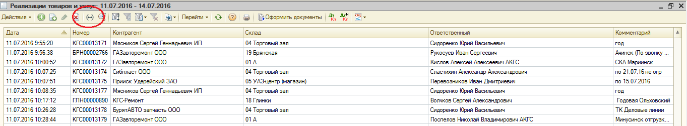
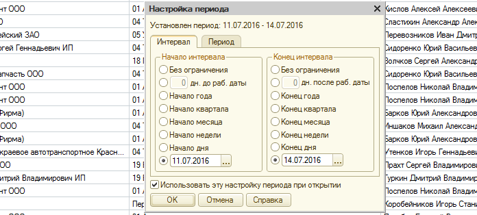
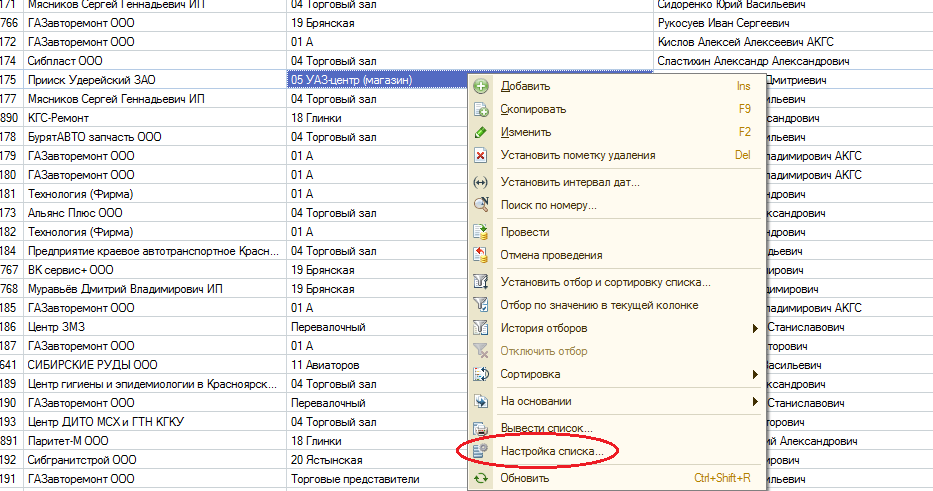
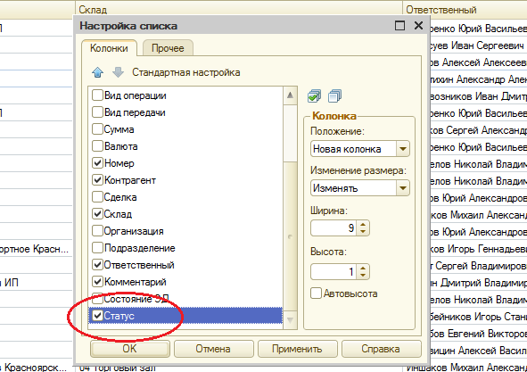
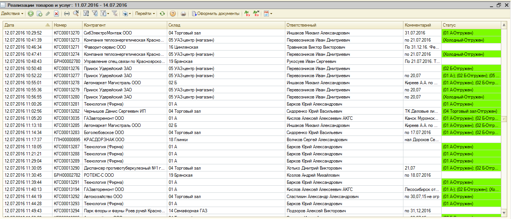
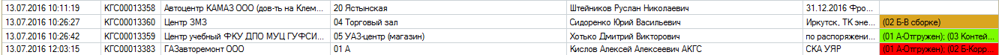
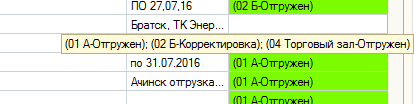
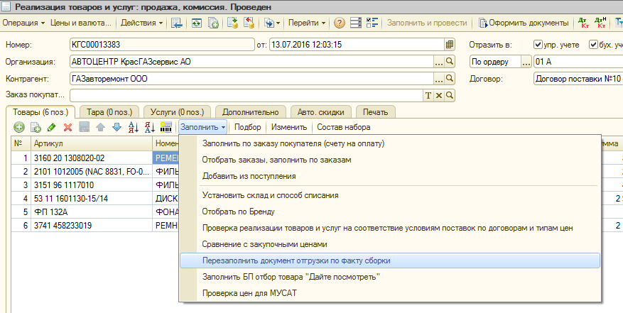
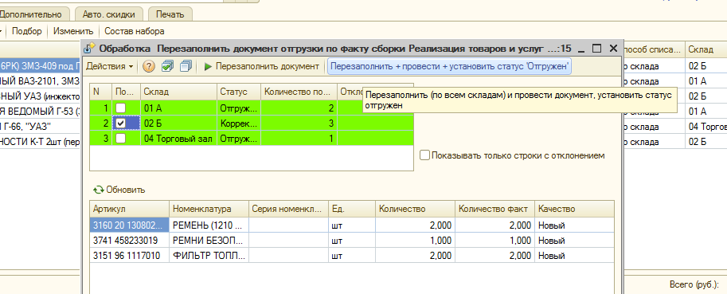

## Регламент по корректировке документов реализации на основании факта складского отбора

Сотрудник отдела продаж, реализуя товар посредством документа «Реализация товаров и услуг: продажа, комиссия» обязан проконтролировать точность выполнения отбора/ отгрузки товара со склада согласно этому документу, только после этого распечатать пакет документов для клиента (товарная накладная, счет-фактура и пр.) в соответствии со складским расходным ордером (фактом сборки).

Возможность контролировать соответствие документа реализации факту сборки есть у каждого сотрудника отдела продаж.

Для этого в списке документов «Реализация товаров и услуг» (далее «РТиУ») необходимо установить период, с расчетом, чтобы интересующие нас документы попадали в установленный период. Нажимаем значок «Установить интервал дат»:

В открывшемся окне задаем интервал, в левой колонке указывая начало периода, в правой — окончание:

После нажатия кнопки «ОК» в списке будут отображаться только те документы «РТиУ», которые входят в заданный интервал.

Далее необходимо вывести статусы для документов в списке. При нажатии правой кнопкой мыши по полю списка документов «РТиУ», откроется окно с перечнем действий, которые можно совершить над списком в целом и отдельными документами в нем:

Необходимо нажать «Настройка списка». После этого откроется дополнительно окно с перечнем всех столбцов, которые могут быть отображены в списке. Рядом со словом «Статус» необходимо поставить «галочку» и подтвердить действие нажатием кнопки «ОК».

Список документов «РТиУ» дополнится столбцом с указанием на статус, в котором находится документ, касательно складской обработки:

Незаполненная строка статуса (заливка белым цветом) означает, что документ на складе еще не взят в работу;

- желтый цвет - означает, что документ находится в сборке (процесс сборки начат, но еще не закончен);
- зеленый цвет — все товары по документу собраны в полном объеме;
- красный цвет — не все товары собраны, есть корректировки (имеются расхождения между документом «РТиУ» и складским фактом сборки).

Пример:

Кроме того, из примера видно, что помимо отличительной заливки, строки содержит словесное пояснение статуса документа: в скобках на первом месте указывается наименование склада, на втором — статус для товаров из документа по данному складу (в сборке/ отгружен/ корректировка). Если складов несколько, информация перечисляется через точку с запятой. Для того, чтобы отобразилась полная информация, достаточно подвести курсор мыши к интересующей строке:

По всем не найденным и не отгруженным позициям на складе проводится работа. Однако, ответственные лица не имеют возможности провести инвентаризацию, переместить товар на склад недостач, изменить товару качество (например, на «брак») и т. д. до тех пор, пока товар не появится в свободном остатке. До момента, пока документ «РТиУ» не скорректирован в соответствии с фактом сборки, не отобранные по нему товары числятся в статусе «к передаче».

Возможность вносить корректировки в документы «РТиУ» имеют следующие сотрудники:

- Безруких Дмитрий
- Утенков Игорь
- Русаков Максим
- Хотько Дмитрий (только для документов, созданных в текущем дне)
- Черных Сергей.

Ответственный за реализацию сотрудник отдела продаж обязан своевременно обратиться к одному из перечисленных выше сотрудников с просьбой скорректировать документ «РТиУ».

Для внесения корректировок в «Реализацию товаров и услуг», необходимо открыть документ из списка, перейти по вкладке «Заполнить» и выбрать «Перезаполнить документ отгрузки по факту сборки».

Открывшаяся после этого Обработка позволяет внести все необходимые корректировки в документ:

