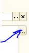
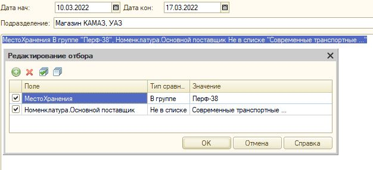

## Если вам требуется пересчитать, товар, находящийся в Ст-1 (Стеллаж 1).

Заходим – сервис – дополнительные внешние отчеты и обработки – обработки – склад – отчет в местах хранения.

1.  Выбираем подразделение.
2.  Выбираем место хранения .
3.  Устанавливаем промежуток времени, дата начала (предыдущий день) Дата кон: (текущая дата)   
4.  Нажимаем редактирование отбора. 
5.  Добавляем поля для отбора 
6.  Жмем выполнить.  
7.  Данный пример показывает, как отфильтровать товар на витрине по основному поставщику.

Получаем отчет с местами хранения (только в этом стеллаже) и конечный остаток товара.

**С помощью этого отчета, возможно, идентифицировать товар по названию, набрав его место хранения.**

## Если вам требуется пересчитать товар одной группы или подгруппы.

Заходим – сервис – дополнительные внешние отчеты и обработки – обработки – склад – отчет по номенклатуре. Выставляем склад, поле «ссылка», тип сравнения «в группе», значение «группа которую необходимо пересчитать», получаем отчет с местами хранения и остатками.