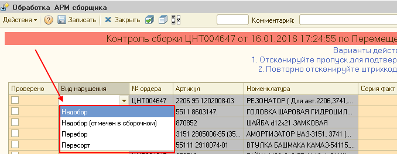
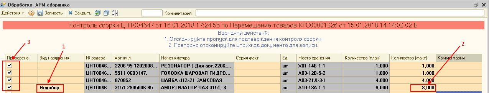

## Оформление выполненного задания на контроль комлектования

Для завершения задания на Контроль комплектования необходимо сканировать документ «Акт контрольной проверки скомплектованной партии товара» два раза

В окне «Обработка АРМ Сборщика» откроется документ «Контроля сборки», в котором предлагается откорректировать количество скомплектованного товара, если оно отличалось от указанного в документе «Акт контрольной проверки скомплектованной партии товара», в таком случае в графе «Вид нарушения» выбираем подходящее:

- **Недобор** – Комплектовщик скомплектовал меньше необходимого количества товара и НЕ сделал пометку об этом в своем документе «Сборка»(ошибся в количестве)

- **Недобор (отмечен в сборочном)** – Комплектовщик скомплектовал меньше необходимого количества товара и сделал пометку об этом в своем документе «Сборка»(недостача товара на складе)

- **Перебор** – Комплектовщик скомплектовал больше необходимого количества товара (ошибся в количестве)

- **Пересорт** – Комплектовщик скомплектовал другой товар вместо необходимого

Теперь в графе «Количество (факт.)» внести фактическое значение скомплектованного товара

Так же в графе «Комментарии» есть возможность оставить дополнительную информацию для контроля работы склада.

В окне «Обработка АРМ Сборщика» для документа «Сборка» галочками пометить товары, по которым проведен контроль в графе «Проверено». Для этого можно вручную выделить каждый товар ИЛИ нажать кнопку «Установить пометки» 

Отсканировать бейдж для подтверждения контроля

Если расхождений и ошибок в комплектовании не было, то для завершения задания на Контроль комплектования необходимо сканировать документ «Акт контрольной проверки скомплектованной партии товара» один раз, затем отсканировать бейдж для подтверждения

Если контроль комплектования еще не завершен, то для его записи отсканируйте документ «Акта контрольной проверки скомплектованной партии товара» еще раз.