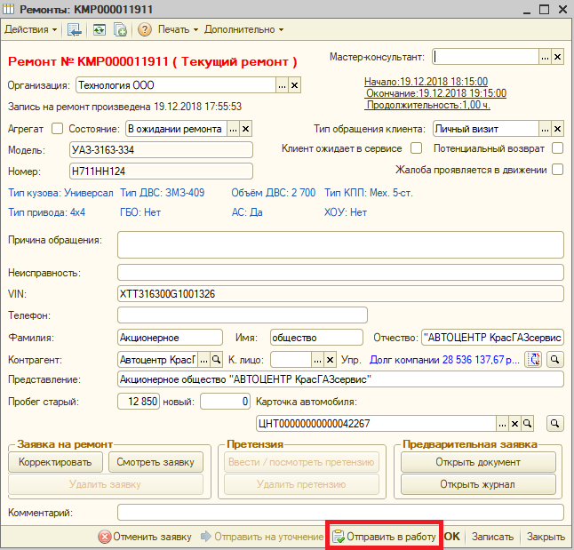
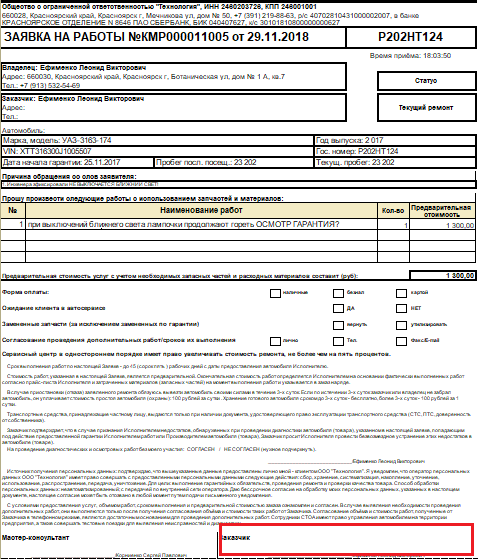

## В.3.2.2.3.4. Оформление необходимых документов по приемке автомобиля

 Если тестовая поездка не нужна, а клиент приехал для выполнения ремонтных работ по ранее выданным предприятием рекомендациям или проведения четко сформулированной им ремонтной операции, мастер-консультант распечатывает заявку на ремонт с актом осмотра автомобиля.См. Рис.8.

Рис.8. Окно «Предварительная заявка на ремонт»

Открываем меню печати, выбираем «Акт приемки» и «Заявка на ремонт», затем отправляем на печать, заполням документы «акт приемки» и «заявка на ремонт» и передаем клиенту на подпись. См.Рис.9.10. После того как распечатали документы, закрываем окно «Предварительная заявка на ремонт» возвращаемся в окно «Ремонты» нажимаем «Отправить в работу» См.Рис.9.

Рис.9. Окно «Ремонты»

Документы распечаты, мастер-консультант берет защитные чехлы и приглашает клиента к осмотру автомобиля.

Мастер-консультант открывает водительскую дверь, надевает защитные чехлы на кресло водителя, рулевое колесо, рычаг КПП. Затем фиксирует в акте осмотра См.Рис.7. показания одометра и уровень топлива в баке. Затем приступает к внешнему осмотру автомобиля и фиксирует повреждения в акте осмотра Рис.7.

Рис.10. Печатная форма «Акта приема передачи»

Рис.11. Печатная форма «Заявка на ремонт»

По окончании осмотра мастер-консультант предлагает клиенту совместно пройти к рабочему столу, обсуждает результаты осмотра, в случае если в процессе осмотра автомобиля возникла необходимости в проведении дополнительных работ, мастер-консультант, вносит согласованные позиции в предварительный заказ-наряд, распечатывает и получает подпись клиента на предварительном заказ-наряде и акте осмотра автомобиля, копию акта осмотра и один экземпляр предварительного заказ-наряда передает клиенту, узнает у клиента будет ли он ожидать в сервисе или нет, в случае ожидания в сервисе провожает в зону ожидания клиентов и сообщает о времени предварительного контакта, в случае если клиент не будет ждать в сервисе, сообщает время предварительного контакта, прощается с клиентом.
