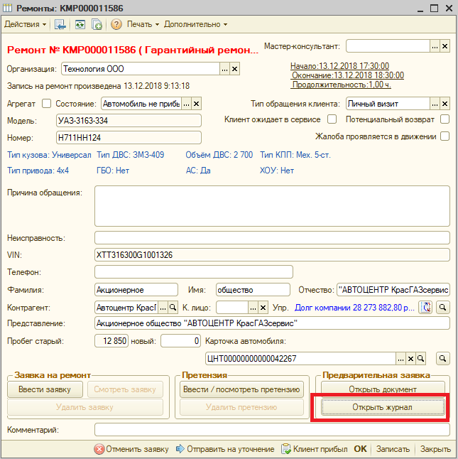
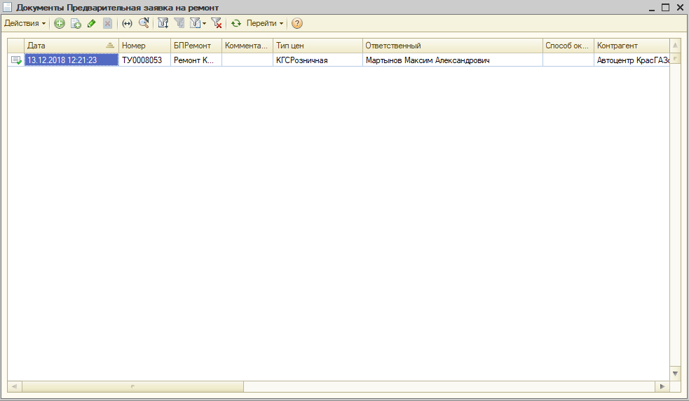
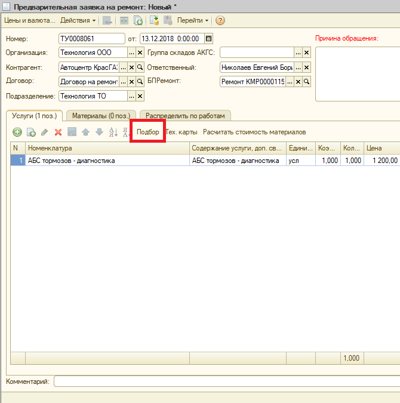
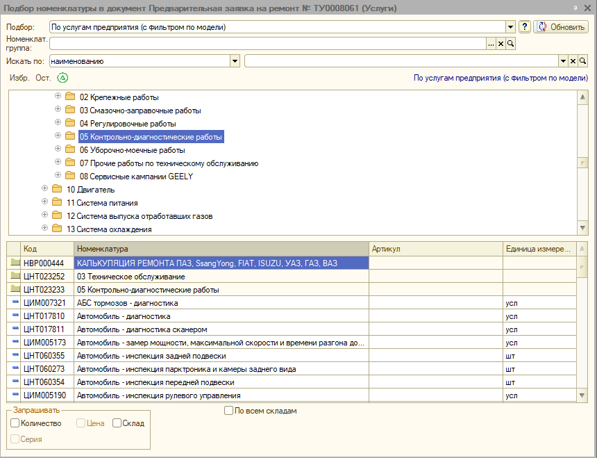
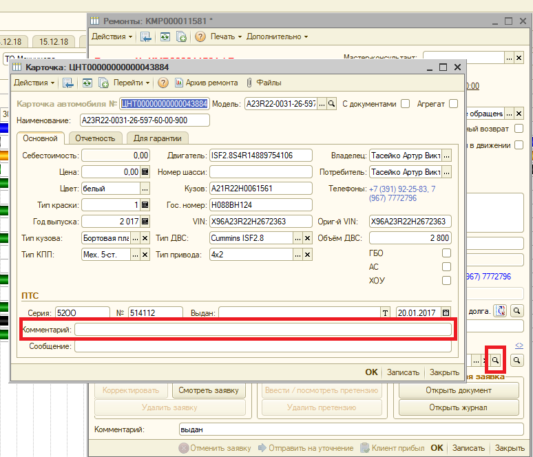

## В.3.2.2.4.3 Оценка проведенной диагностики неисправностей и согласование с клиентом.

В случае, если предполагаемый ремонт не покрывается гарантийными обязательствами, мастер-консультант добавляет работы в ранее открытый заказ-наряд.   

Мастер-консультант получив дефектовочную ведомость вносит дополнительные работы в имеющуюся заявку на ремонт. Заходим в нужную заявку, выбираем «открыть журнал» См. Рис.23.

Рис.22. Окно «Ремонты»

Открывается новое окно «документы предварительная заявка на ремонт» находим в нем нужную заявку См. Рис.23

Рис.23. окно «Документы предварительная заявка на ремонт»

В новом окне нажимаем F9, после нажатия откроется новое окно «предварительная заявка на ремонт новый» См. Рис.24.

Рис. 24. Окно «предварительная заявка на ремонт новый»

В новом окне выбираем «Подбор» открывается окно «Подбор номенклатуры в документ» См. Рис.25.

Рис.25. Окно «Подбор номенклатуры в документ»

Подбираем необходимые ремонтные операции, записываем документ, определяем общую стоимость расширения заказ наряда, определяем временные ресурсы необходимые для выполнения работ затем звоним клиенту, представляемся осуществляем взаимное приветствие, затем сообщаем результаты проведенной диагностики и стоимость предполагаемого ремонта с заменой деталей. Получаем согласие и передаем информацию мастеру цеха, при этом перепланируем время завершения работы.

В случае, если клиент отказался на текущий момент выполнять работы, нужно предложить клиенту сделать запись на другой день

В случае, если клиент отказался от записи, отмечаем перечень работ и деталей в карточку автомобиля См.Рис26. при следующем обращении клиента эта информация появится автоматически в момент создания предварительной записи.

Рис.26. Окна «ремонты» «карточка»
