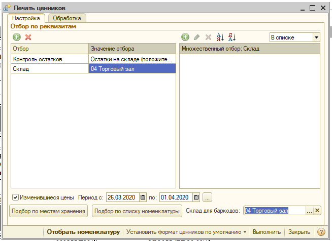

## Периодичность проверок переоценки товаров устанавливает директор магазина, но не реже 1 раза в неделю.

Директор магазина обязан составлять график переоценок с конкретно ответственными лицами за его исполнение. Директор магазина и старший продавец должны контролировать выполнение переоценок согласно, установленного графика. При выявлении не совпадения, ценника с реальной стоимостью товара, директор несет ответственность лично.

Для проверки изменившихся цен и печати ценников необходимо войти:

Сервис → дополнительные внешние отчеты и обработки → обработки → торговля → печать ценников мбк.

В открывшемся окне устанавливаем:

1.  Контроль остатков (остатки на складе положительные) 
2.  Склад (выбираем свой магазин)
3.  Ставим галочку (изменившиеся цены)
4.  Выставляем период с (дата последней проверки) по (текущая дата)
5.  Нажимаем (отобрать номенклатуру)
6.  Устанавливаем формат ценников, штрих код (если требуется)
7.  Отправляем на печать.
8.  Если необходимо бар-коды на ценниках, заполните «Склад для бар-кодов».

Распечатанные ценники режем и размещаем на товаре в торговом зале.

**Для контроля соответствия ценников, мест хранения и остатков.**

Сервис-Отчеты и обработки-Отчеты-Торговля-Реестр номенклатуры у которой изменилась цена.