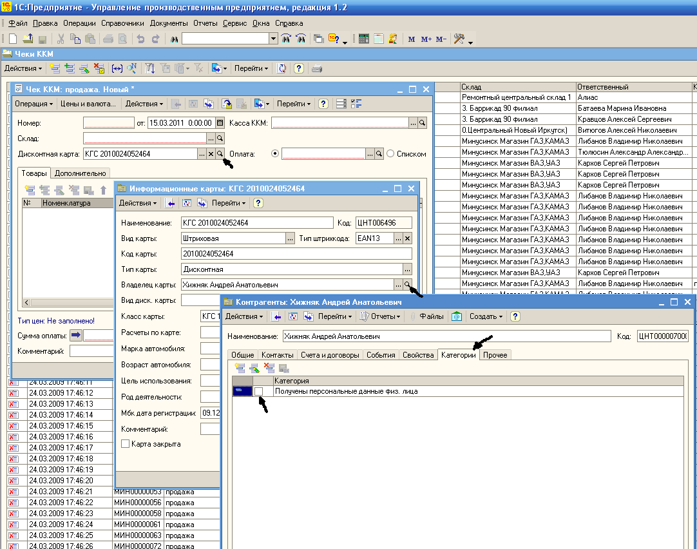
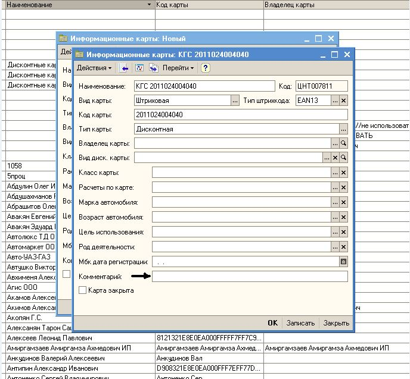

Менеджер обязан:

1. Проверить, получено ли согласие на обработку персональных данных с клиента
2. Если согласие получено, во вкладке «Категории» элемента справочника «Контрагенты» должна стоять галочка напротив строки «Получены персональные данные физ.лица» (Рис.1).

Рис.1

3. Если галочки не стоит, предложить клиенту заполнить АНКЕТУ нового образца (Приложение 1) либо (Приложение 3) объяснить, что этого требует закон «О персональных данных». Необходимо проследить, чтобы ФИО, адрес, паспортные данные были заполнены разборчивым подчерком, Обязательна подпись получателя карты.
4. Самостоятельно заполнить в АНКЕТЕ номер карты, дату выдачи, скидку, подразделение, ФИО ответственного лица и подпись (ОБЯЗАТЕЛЬНО заполнить ВСЕ ПОЛЯ)
5. В случае **отказа** от заполнения АНКЕТЫ предупредить, что при утере или порче ДК восстанавливается исключительно при условии правильного заполнения Анкеты, в этом случае все накопления сохраняются. В противном случае клиент сможет получить новую ДК со скидкой 3% в соответствии с положением о скидках, предоставляемых АВТОЦЕНТРом КрасГАЗсервис (ПРИЛОЖЕНИЕ 2).
6. Выдать карту, в АНКЕТЕ сделать пометку «ОТКАЗАЛСЯ ПРЕДОСТАВИТЬ ПЕРСОНАЛЬНЫЕ ДАННЫЕ», самостоятельно заполнить номер карты, дату выдачи, скидку, подразделение, ФИО ответственного лица и подпись (ОБЯЗАТЕЛЬНО заполнить ВСЕ ПОЛЯ).
7. Такую же пометку сделать в самой ДК (Рис.2).

Рис. 2

 8. Внести информацию о полученных данных в форму **«Журнал учета согласий субъектов персональных данных»** (Приложение 4) и непосредственно в сам **Журнал учета согласий субъектов персональных данных,** который хранится в каждом магазине.
 9. **Передать анкету в отдел маркетинга.** Форма (Приложение 4) передается в отдел маркетинга вместе с заполненными АНКЕТАМИ. Количество заполненных анкет должно четко соответствовать количеству записей в журналах.