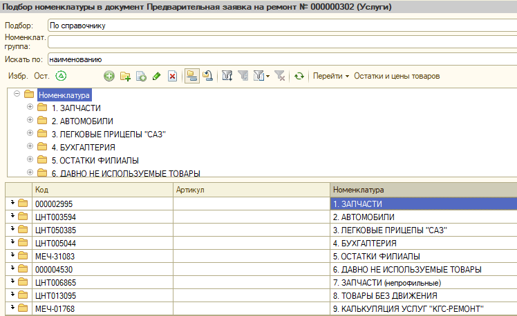

## В3.2.2.1.3 Согласование стоимости и времени визита

Согласовать с клиентом стоимость предстоящего обслуживания, при необходимости разъяснив цены попозиционно, отметив, если применимо, какие запасные части будут использованы в ходе обслуживания.

19. В новом окне: «Предварительная заявка на ремонт» выбираем: «Подбор» автоматически открывается окно «Подбор номенклатуры в документ» Рис.20.

Рис.20. Окно «Предварительная заявка на ремонт» Подбираем услуги и детали

20. Открывается новое окно «Подбор номенклатуры в документ» Выбираем «калькуляция ремонта», далее выбираем модель автомобиля

Рис.20. Окно «Подбор номенклатуры в документ» Подбираем услуги ремонта.

21. В том же окне, выбираем детали и материалы, выбрали услуги и детали, закрываем окно «Подбор номенклатуры в документ» автоматически возвращаемся в окно «Предварительная заявка на ремонт»

Рис.21. Окно «Подбор номенклатуры в документ» Выбираем детали и материалы

22. Услуги и детали подобраны, нажимаем «ок» документ записан и закрыт, после закрытия окна «Предварительная заявка на ремонт» автоматически возвращаемся в окно «Ремонты» Рис.23.

Рис.22. Окно «Предварительная заявка на ремонт» записываем и закрываем документ.

23. Нажимаем «ок» документ «ремонты» записан и закрыт, автоматически возвращаемся в график времени Рис.24.

Рис. 23. Окно «Ремонты» записываем и закрываем документ.

Согласовать с клиентом и зафиксировать в программе записи выбранный вариант времени визита.

Подвести итоги, упомянув о времени, к которому клиенту необходимо прибыть на обслуживание, попросив, по возможности, не опаздывать, время окончания обслуживания, цену, а также набор документов, необходимых для запланированного обслуживания.

24. Растягиваем полосу по диаграмме времени в зависимости от норм времени предварительной заявки

Рис.24. Окно «График» Выбираем продолжительность ремонта

25.  В случае если запись произведена на дни, отличные от текущего и последующего, проинформировать клиента о том, что за день до визита ему будет произведен звонок с напоминанием о визите.
26. Сохранить созданную заявку вежливо попрощаться, заверив, что компания будет рада обслуживать записанный автомобиль

>  **Прошу Вас не забыть взять с собой: сервисную книжку, свидетельство о регистрации, документ, удостоверяющий личность, доверенность (если не собственник или машина на юр. Лице).**
  >
  >
>**Мы позвоним Вам за сутки до Вашего приезда и напомним о визите к нам.**
>
>**Благодарю Вас за звонок.**
   >
>**До свидания.**
  
  

  
  

  
  

  
  

**Завершение процесса предварительная запись**
