# СТАНДАРТ ВВОДА НОВОГО КОНТРАГЕНТА В БАЗУ 1С

[Файл версии от 2009 года](UPP/_attach/Правила%20ввода%20КОНТРАГЕНТА%20В%20БАЗУ%201С%20(ПРОЕКТ).doc)  
[Файл версии от 2014 года](UPP/_attach/Правила%20ввода%20нового%20контрагента%20в%201С%208%20от%202014г.doc) 

 
В соответствии с Инструкцией **(утвержденную в 2014 году Генеральным директором ЗАО «АКГС» Молчановым В. А.)** по вводу контрагентов в программу **1С** при вводе контрагента, сотрудник, получивший доступ от Отдела ИТ, должен и обязан внести всю информацию о клиенте, которой он располагает на момент ввода (или может получить от представителя контрагента), а так же по мере поступления информации от самого контрагента (бухг-я, письмо).

  
### ПОШАГОВАЯ ИНСТРУКЦИЯ ВВОДА НОВОГО КОНТРАГЕНТА

**ДЛЯ ЮРИДИЧЕСКИХ ЛИЦ (ПОКУПАТЕЛИ)**
1.  ШАГ **№1** _нажимаем вкладку_ **«****Документы****»**
2.  ШАГ **№2** _выбираем пункт_ **«Управление продажами»**
3.  ШАГ **№3** _нажимаем пункт_ **«Реализация товаров и услуг»**

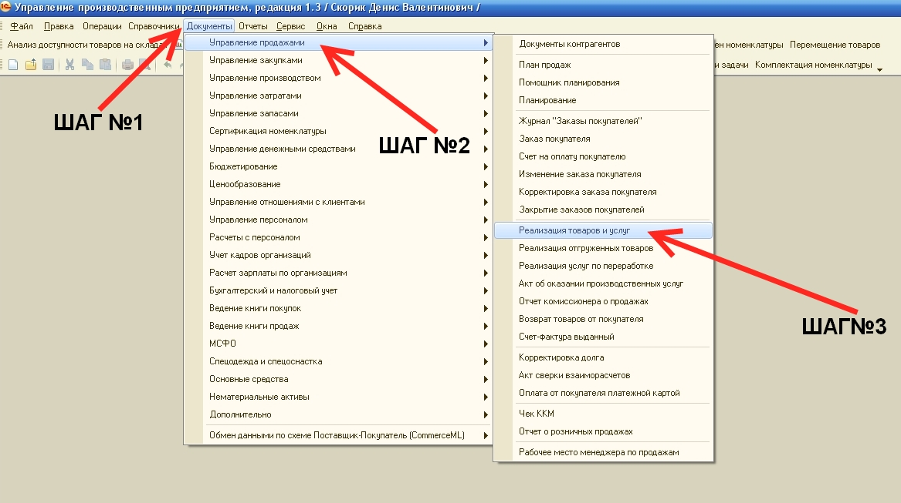
4.  ШАГ **№4** _нажимаем кнопку_  **«Добавить»** _или клавишу на клавиатуре персонального компьютера_ «Insert»

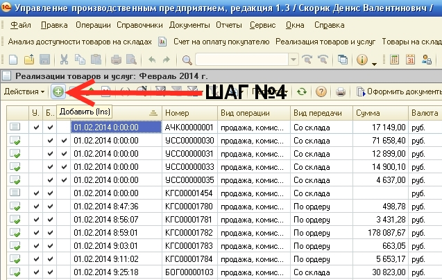

5.  ШАГ**№5** _нажимаем_  _или клавишу на клавиатуре персонального компьютера_ «F4»

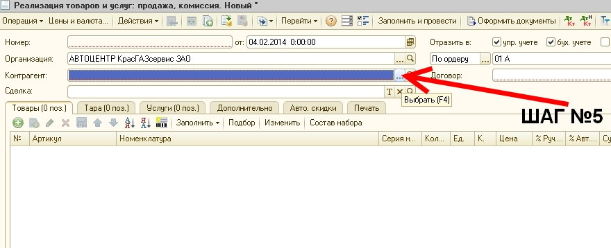

6.  ШАГ **№6** _Поиск организации по_ **«ИНН»**
-   **«А»** _отключаем иерархию_  
- **«Б»** устанавливаем сортировку по_ ИНН 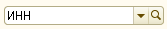
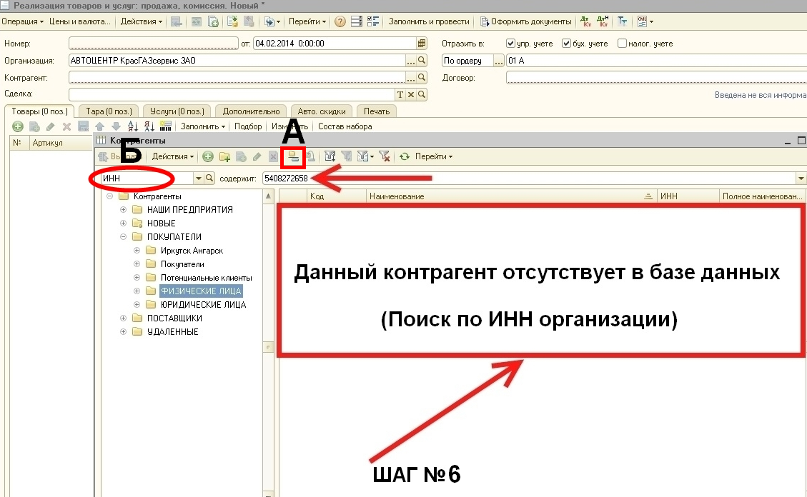

7.  ШАГ **№7** _Поиск организации по_ **«НАИМЕНОВАНИЮ»**
-   **«А»** _отключаем иерархию_ 
- **«Б»** устанавливаем сортировку по Наименованию  
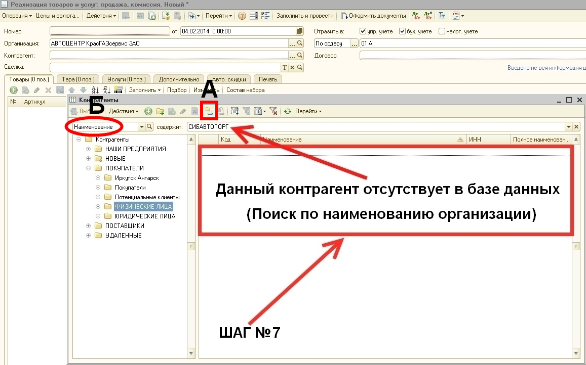

8.  ШАГ **№9** _Добавляем нового контрагента_

_Для ввода нового контрагента_ _нажимаем кнопку_  **«Добавить»** _или клавишу на клавиатуре персонального компьютера_ **«Insert»**
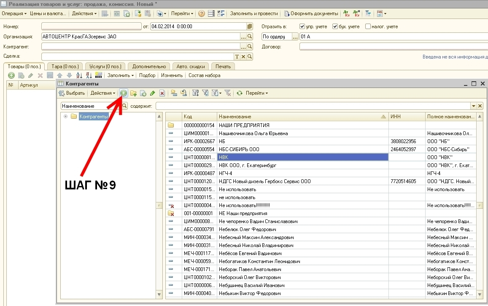

9.  ШАГ **№ 10,11,12,13,14,15,16,17** (ЗАПОЛНЯЕМ ПОЛЯ)

_Вносим все имеющиеся реквизиты контрагента._

10. ШАГ **№10 «Наименование»** _вводим_ _точное_ _юридическое наименование_, _после наименования вводим через один пробел организационно-правовую форму предприятия_ **ООО, ЗАО, ФГУП** без кавычек, скобок и т.п. **(ОБЯЗАТЕЛЬНО)**    

**!** Если в **полном наименовании** организации стоят слова **комбинат, завод, школа, училище, институт, университет, больница, администрация, АТП, банк** и тому подобное, то это слово в **наименовании** необходимо вывести на первое место.

_**Например:**_

ОАО “Ачинский глиноземный комбинат” – Комбинат глиноземный Ачинский ОАО
ОАО “Красноярский алюминиевый завод”– Завод алюминиевый красноярский ОАО
Акционерный коммерческий банк “Кедр ”- Банк Кедр АК
Енисейская клиническая больница – Больница клиническая енисейская
Профессиональное медицинское училище – Училище медицинское профессиональное

Если в наименовании организации присутствует аббревиатура, то использовать принятые сокращения

**НАПРИМЕР:**
**КГБУ ДЮСШ** – ДЮСШ КГБУ
**МУВД г. Зеленогорска** – УВД г. Зеленогорска

**ВНИМАНИЕ!!! При написании наименовании организации перед и после дефисов пробелы ставить ЗАПРЕЩЕНО.**

11.  ШАГ **№11** **«Вид»** _выбираем_  **(ОБЯЗАТЕЛЬНО)**

12.  ШАГ **№12** _вводим_ **без пробелов, кавычек,** **скобок и т.п.** «**ИНН»** **(ОБЯЗАТЕЛЬНО)** ИНН состоит из 10 цифр. Пример: 2462030571

13.  ШАГ **№13** _вводим_ **без пробелов, кавычек,** **скобок и т.п.** **«КПП»** **(ОБЯЗАТЕЛЬНО)** КПП состоит из 9 цифр. Пример: 246301001

14.  ШАГ **№14** _вводим_ **«Полное наименование»** **(ОБЯЗАТЕЛЬНО)**

_Полностью расшифровываем_ _организационно-правовую форму предприятия_ **ООО, ЗАО,** **ФГУП** _после этого_ **вводим в кавычках наименование организации**
Пример: Общество с ограниченной ответсвенностью "Автоторг"

15.  ШАГ **№15** _вводим_ **«Код по ОКПО»** (По возможности)

16.  ШАГ **№16** _ставим_ «галочку» **(ОБЯЗАТЕЛЬНО)**  
17.  ШАГ **№17** _выбираем_ «**Регион»**, _в котором зарегистрирован контрагент_ **Вводим край и город** **(ОБЯЗАТЕЛЬНО)**

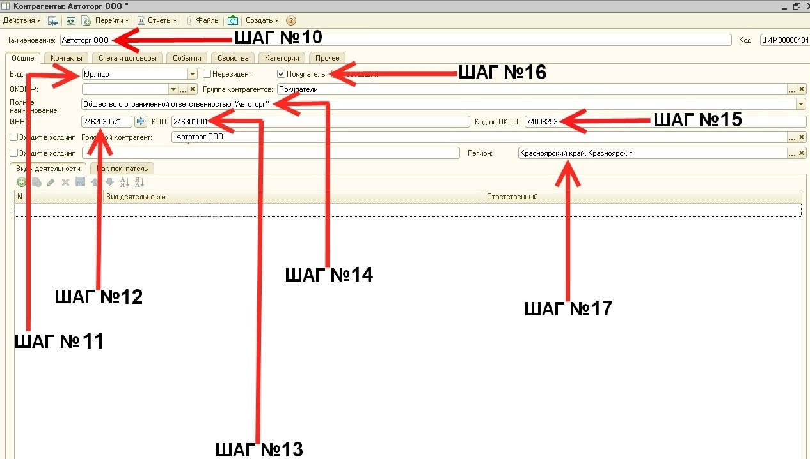
_После того, как реквизиты заполнены, для записи элемента следует нажать кнопку «Записать», расположенную в правом нижнем углу._

18.  ШАГ **№18** _Вводим_ **«Юридический и Фактический адреса»** **(ОБЯЗАТЕЛЬНО)** **!** _**Пример:**_ 660118, Красноярский край, Красноярск г., 9 Мая ул., дом №47, кв.10

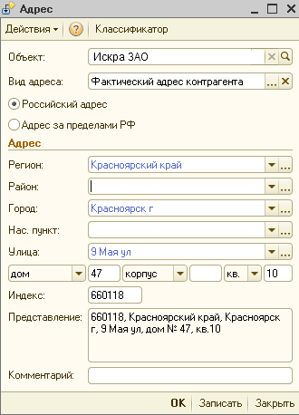
- _После заполнения данных полей для записи элемента следует нажать кнопку «Записать», расположенную в правом нижнем углу._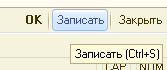 
- Вводим_ _с указанием кода города_ **«Телефон контрагента» (ОБЯЗАТЕЛЬНО) !** 

>_**Пример:**_

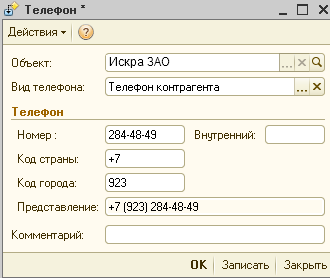
- _После заполнения данных полей для записи элемента следует нажать кнопку «Записать», расположенную в правом нижнем углу._

- Вводим с указанием кода города **«Факс контрагента» (ОБЯЗАТЕЛЬНО)** **!**
- Вводим с указанием кода города **«Телефон Директора»** (По возможности)
- Вводим с указанием кода города **«Телефон Бухгалтерии» (ОБЯЗАТЕЛЬНО)** **!**
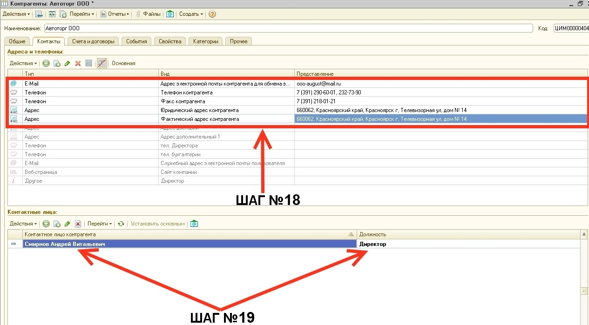

19.  ШАГ **№19** _заполняем поле_ **«Контактные лица»**
		- _заполняем_ **ФИО** _руководителя_ **(ОБЯЗАТЕЛЬНО)** **!**
		- _заполняем_ **ФИО** _главного бухгалтера_ **(ОБЯЗАТЕЛЬНО)** **!**
		- _заполняем_ **«Контактное лицо»** **(ОБЯЗАТЕЛЬНО) !**
		- После того как ФИО руководителя, главного бухгалтера, контактного лица заполнены, для записи элемента следует нажать кнопку «Записать», расположенную в правом нижнем углу.

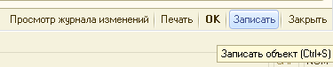

20.  ШАГ **№20** _вкладка_ **«Счета и договора»**
		_Нажимаем кнопку_  **«Добавить»** _или клавишу на клавиатуре персонального компьютера_ **«Insert»**
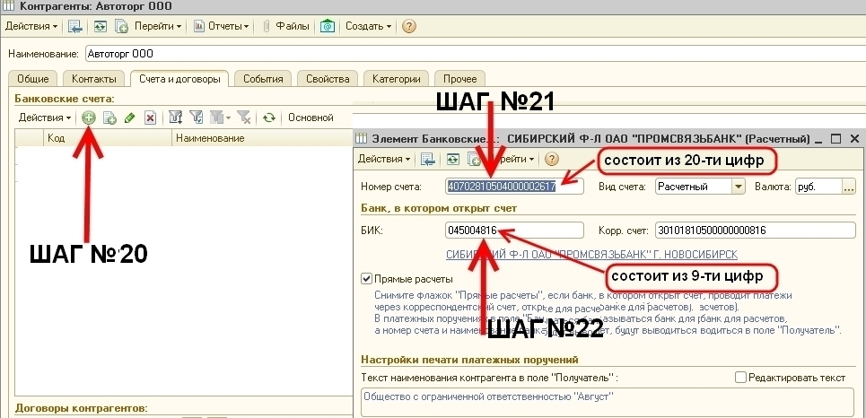

21.  ШАГ **№21** _вводим_ **без пробелов, кавычек, скобок и т.п.** **«Номер счета»**

> **! "Номер счёта" состоит из 20 цифр !**

22.  ШАГ **№22** _вводим_ **без пробелов, кавычек, скобок и т.п «БИК»**

_После заполнения данных полей для записи элемента следует нажать кнопку «Записать», расположенную в правом нижнем углу._

23.  ШАГ **№23** _выбираем расчетный счет и делаем его_ **«основным»!** 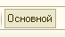
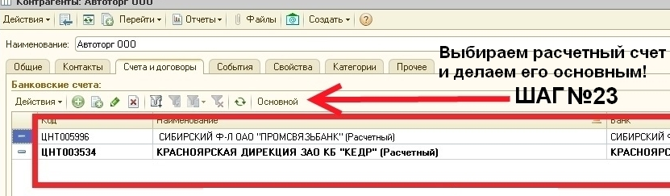

24.  ШАГ **№24** _Договоры контрагентов_

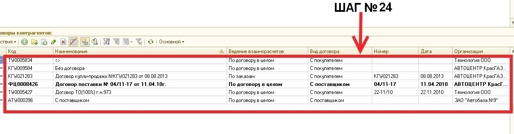

25.  ШАГ **№25** 
		_Нажимаем кнопку_  **«Добавить»** _или клавишу на клавиатуре персонального компьютера_ **«Insert»**
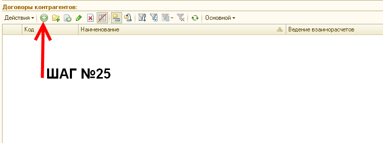

26.  ШАГ **№26,27,28,29** _заполняем поля в карточке_ **«Договор контрагента»**

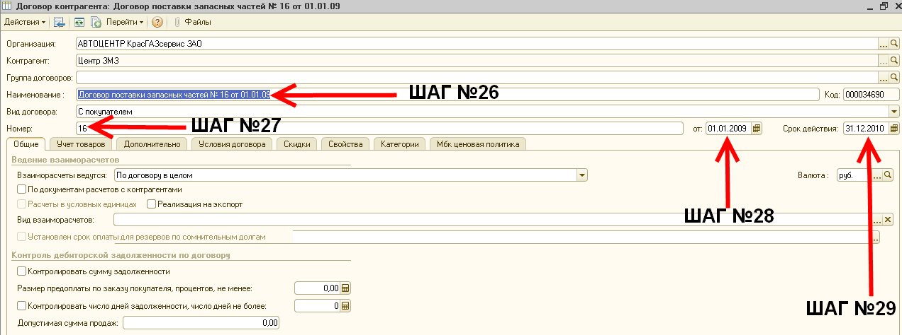

_После заполнения данных полей для записи элемента следует нажать кнопку «Записать», расположенную в правом нижнем углу._