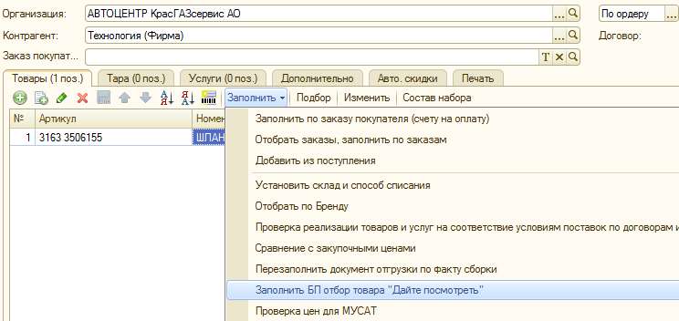
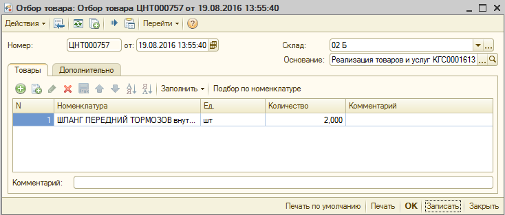
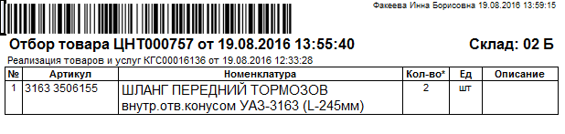

## БП "Дайте посмотреть"

Из документа «Реализация товаров и услуг» по вкладке «Заполнить» выбрать «Заполнить БП отбора товара «Дайте посмотреть»:

Открывшийся документ «Отбор товара» необходимо записать, после этого его можно распечатать.

Печатная форма будет выглядеть следующим образом (соответственно, поле «Номенклатура» будет заполнено тем товаром, который был выбран):

С этим документом покупатель может пройти на склад «02Б» (весь товар с качествами «Уценка1» и «Уценка2» хранится в специальной зоне склада «02Б»), где ему продемонстрируют товар и характер повреждения, после чего работники склада снова унесут товар по месту его хранения. Если покупателя устраивает товар, и он принимает решение о покупке, он снова возвращается в торговый зал, где ему должны быть выписаны документы на реализацию.