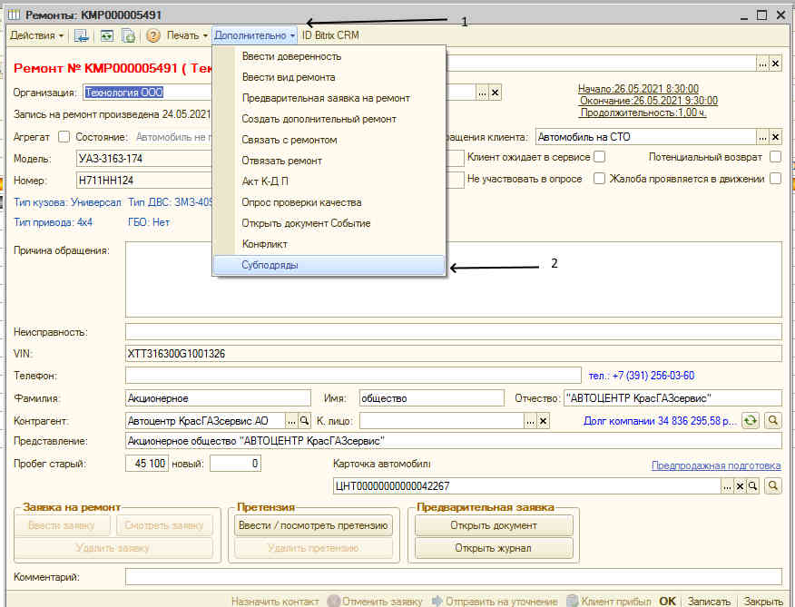
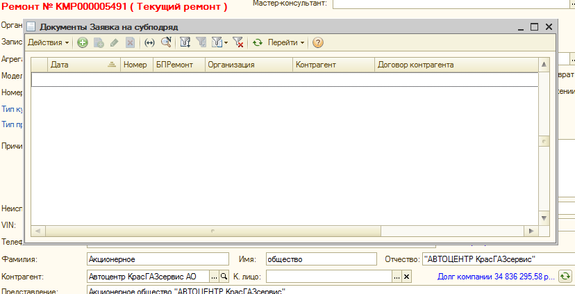
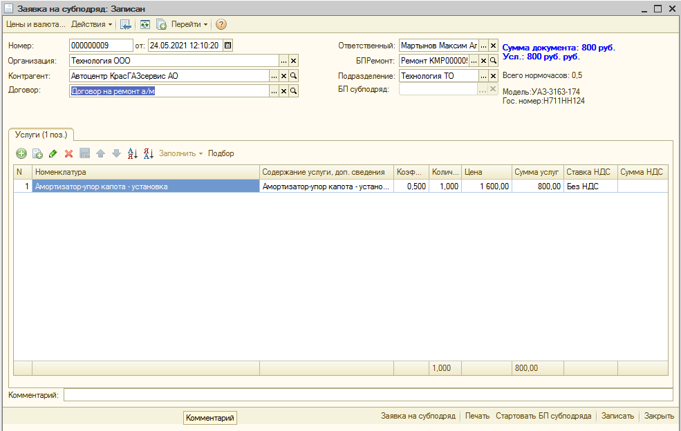
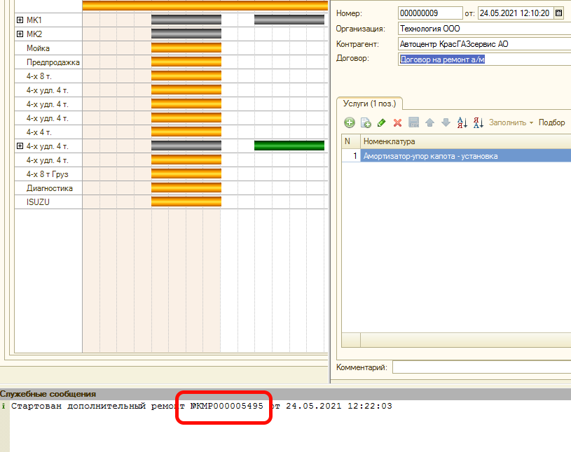
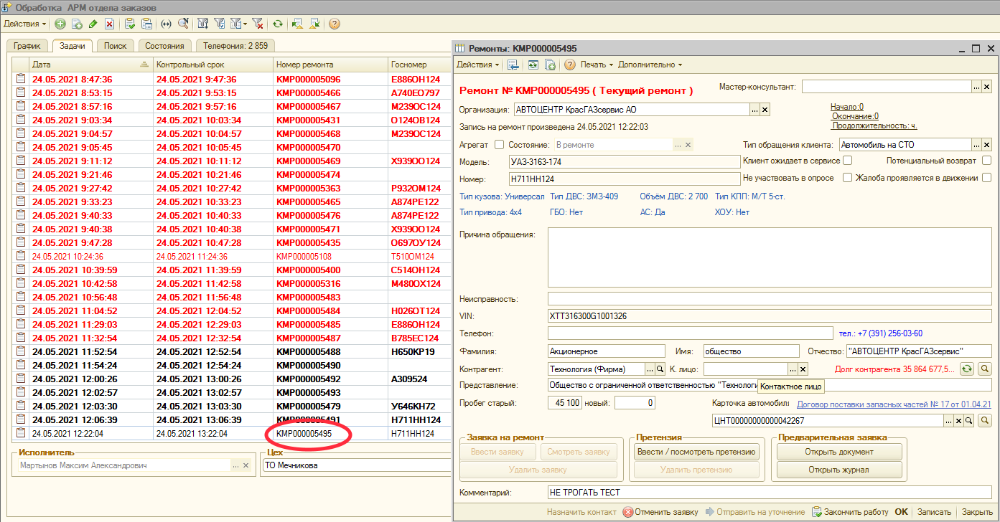
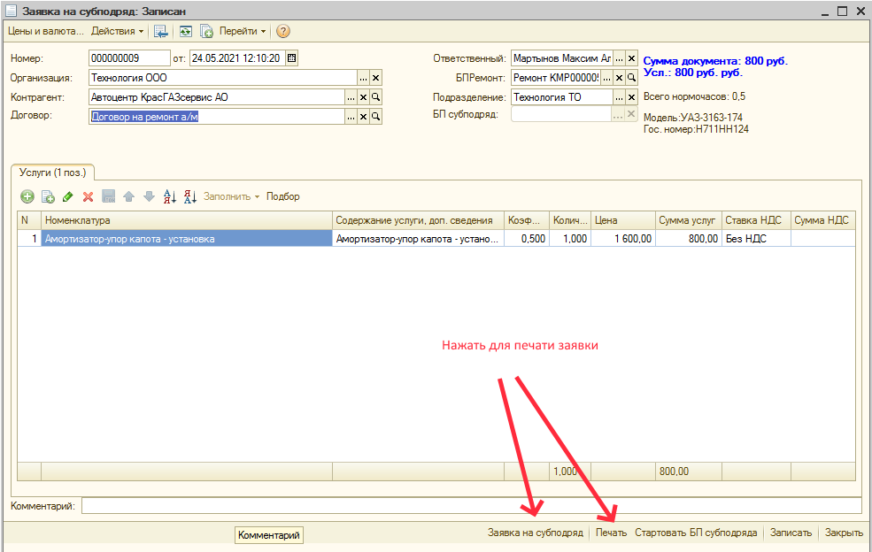
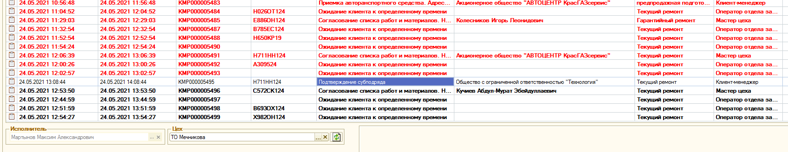
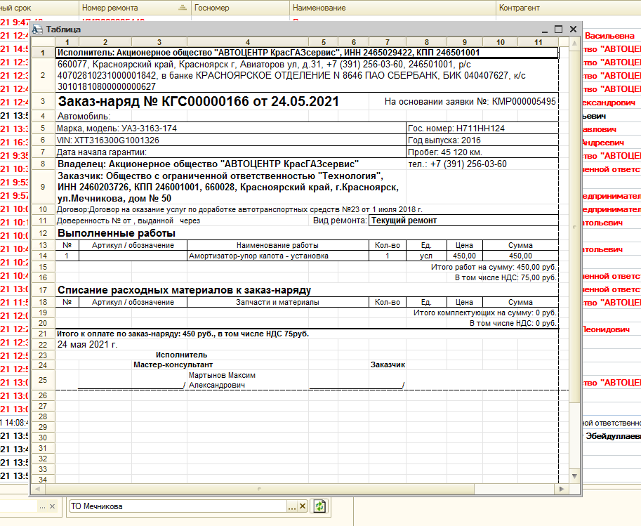
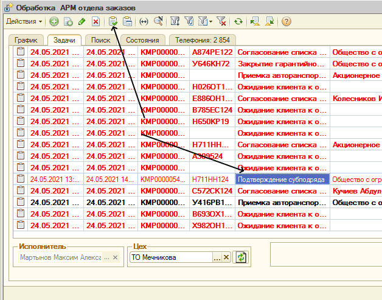
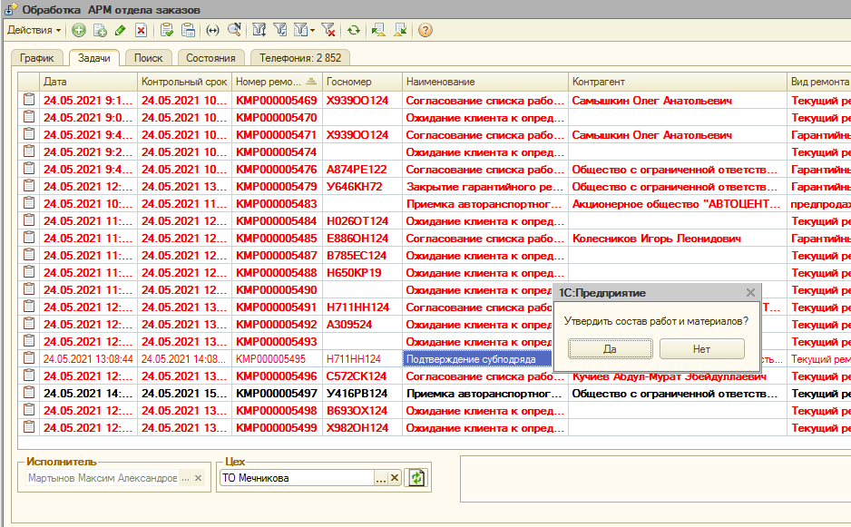

## ИНСТРУКЦИЯ Оформление и перевыставление услуг оказываемых по субподряду..

Настоящая инструкция описывает процесс создания субподрядного ремонта в группе компаний АО АКГС.

Рассмотрим процесс на примере, когда основным исполнителем является ООО «Технология», а субподрядчиком будет являться участок Тюнинга АО АКГС.

При приеме автомобиля создается заявка на ремонт автомобиля по стандартному процессу приема автомобиля в ремонт.

Если необходимо выполнить работы с привлечением субподрядчика, необходимо стартовать субподрядный ремонт. Для этого в карточке записи основного ремонта по нажатию кнопки «Дополнительно» в выпадающем списке выбираем – «Субподряды»

В результате откроется окно «Документы Заявка на субподряд»

Далее нажатием на «+» или клавишей «Ins» создаем заявку на субподрядный ремонт.

Заполняем поля:
- Организация: – организация, заказывающая субподрядные работы.
- Контрагент: – организация, выполняющая субподрядные работы.
- Договор: - выбираем договор, на основании которого выполняем работы.

Во вкладке «Услуги» подбираем работы, которые необходимо выполнить субподрядчиком.
После внесения всех необходимых данных нажимаем кнопку «Стартовать БП субподряда»
При старте БП субподряда система выдаст Служебное сообщение:

Стартованный дополнительный субподрядный ремонт отражается в журнале задач

Субподрядчик выполняет работы используя этот стартованный БП и на основании распечатанной заявки на ремонт.
БП стартуется сразу для организации выполняющей работы, заказчиком автоматически указывается организация заказывающая работы по субподряду.
Распечатываем заявку на выполнение работ по субподряду нажатием кнопки «Печать» или «Заявка на субподряд».

Выводится на печать заявка, аналогичная при стандартном приеме клиента.
Заявка подписывается сторонами и автомобиль передается субподрядчику.
Далее выполнение работ по БП субподряда аналогично обычному выполнению ремонта.
Вносятся работы, добавляются используемые материалы, заполняются исполнители и т.д. по процессу.

По завершении работ с автомобилем субподрядчик в карточке ремонта нажимает кнопку «Закончить работу»

В результате создается задача заказчику субподрядных работ «Подтверждение субподряда»

Двойным щелчком по задаче или нажатием клавиши Enter выводится форма заказ-наряда для ознакомления и подтверждения или отклонения результатов выполненной работы субподрядчиком.

Для подтверждения или отклонения задачи выделяем задачу в журнале и нажимаем кнопку «Завершить задачу»

Система выдаст запрос : «Утвердить состав работ и материалов?»

При ответе «Нет» - документ отправляется на доработку субподрядчику для исправления замечаний.

Замечания передаются средствами электронной почты или по телефону.

После внесения корректировок субподрядчик опять нажимает кнопку «Завершить работу» и процесс согласования повторяется.

При ответе «Да» - формируется акт об оказании услуг от субподрядчика на заказчика работ и далее процесс происходит по стандартной схеме работы по процессу ремонта.

После проведения Акта выполненных работ услуги и материалы из акта субподрядчика копируются в акт об оказании услуг заказчика работ.

Услуги отражаются в общем списке услуг, материалы в вкладке «Материалы субподрядчика».

Необходимо проставить исполнителя услуги из справочника исполнителей.

Распределить материалы из вкладки «Материалы субподрядчика» на услуги субподрядчика.

Далее БП основного ремонта выполняется по стандартному алгоритму.