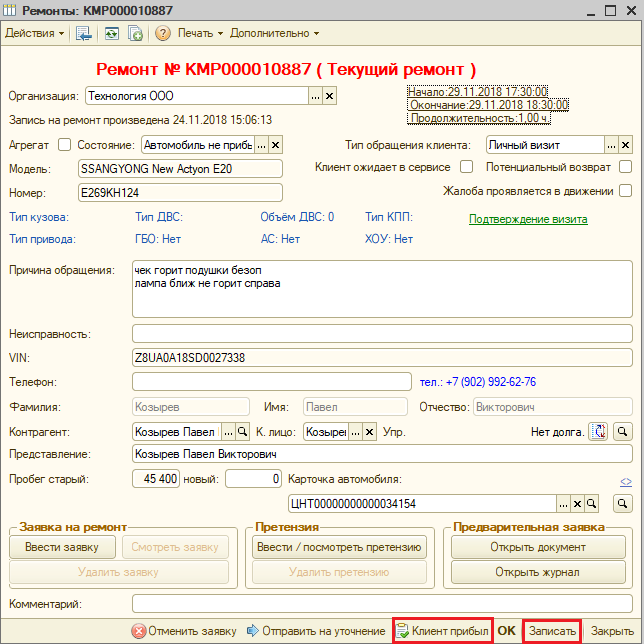
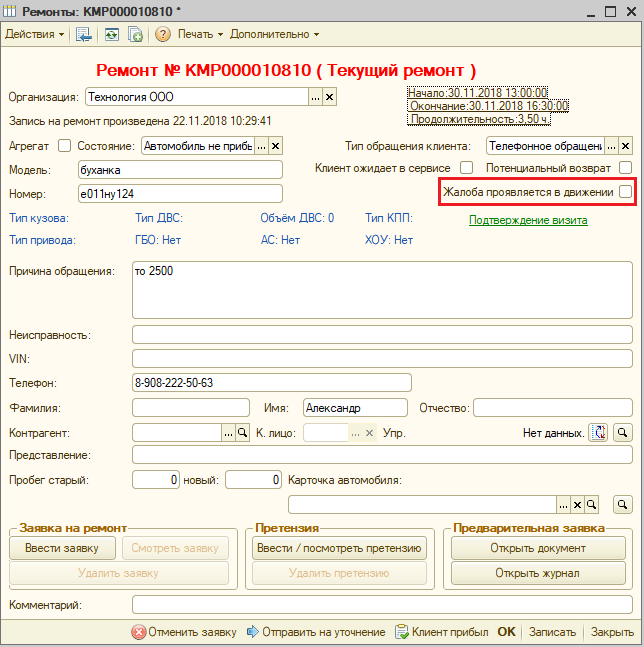
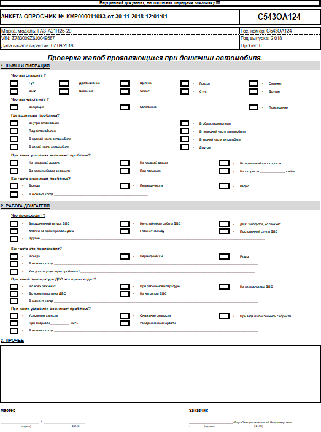
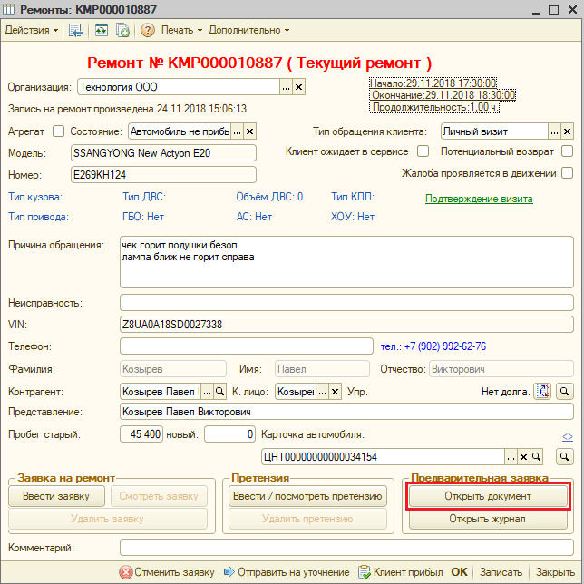
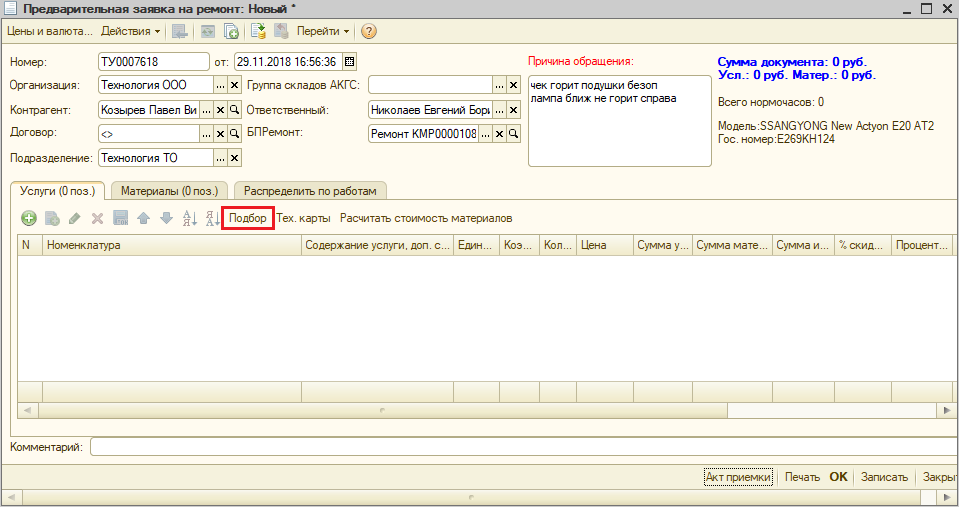
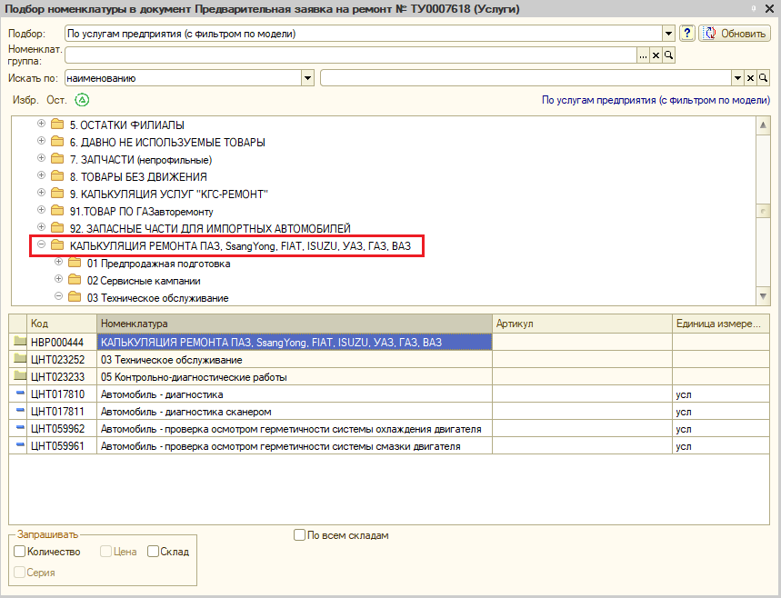
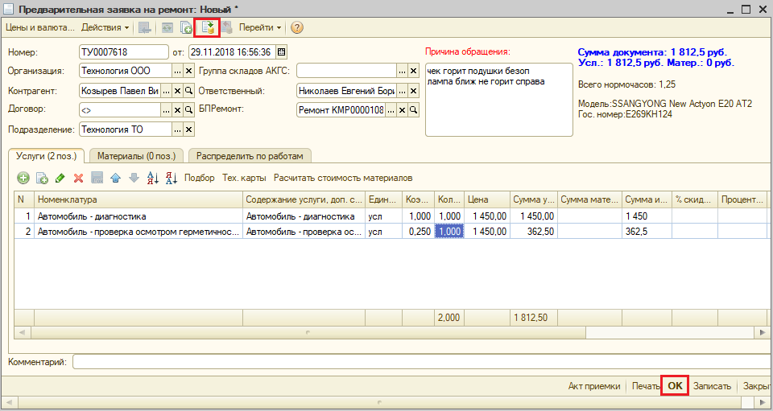

## В.3.2.2.3.3. Определение перечня необходимых диагностических и ремонтных работ.

Идентифицировав автомобиль и клиента, мастер-консультант ставит в записи отметку о приеме автомобиля, нажимаем «клиент прибыл», затем нажимаем «записать» См.Рис.1. возвращает клиенту ранее взятые документы.

Рис.1. Окно «Ремонты»

В случае если клиент, помимо всего прочего, обращается с какой-либо жалобой на автомобиль, проявляющейся в движении, мастер-консультант совместно с клиентом выполняет тестовую поездку для демонстрации проблем с автомобилем, беспокоящих клиента, предварительно делает отметку о проявлении жалобы клиента в движении. **См.Рис.2.** В случае, если сделана отметка, о проявлении жалобы в движении в печатной форме автоматически добавляется «Анкета опросник» **См. Рис.3.** При проведении тестовой поездки мастер-консультант заполняет анкету опросник в зависимости от проявления жалоб клиента.

Рис.2. Окно «Ремонты»

Рис.3 Печатная форма «анкета опросник»

По окончании тестовой поездки мастер-консультант либо подтверждает факт наличия проблемы, добавляя в заказ-наряде необходимые диагностические операции См.Рис.4.

Рис.4 Окно «Ремонты»

Выбираем «открыть документ» затем открывается окно «предварительная заявка на ремонт» См.Рис.5.

Рис.5. Окно «Предварительная заявка на ремонт»

В окне «Предварительная заявка на ремонт» Выбираем «Побор» открывается новое окно «Подбор номенклатуры в документ» См.Рис.6.

Рис.6. Окно «Подбор номенклатуры в документ»

Выбираем нужные ремонтные операции, затем закрываем окно, возвращаемся в окно «Предварительная заявка на ремонт» См. Рис.5.

Рис.7. Окно «Предварительная заявка на ремонт»

Нажимаем на кнопку провести, затем нажимаем «ок» Необходимые диагностические операции подобраны.

Либо сообщаем клиенту об отсутствие проблемы на автомобиле (проблема не проявилась, проявление беспокоящее клиента, - штатная особенность автомобиля и т.д.).

Отсутствие проявления проблемы при тестовой поездке - основание для мастера-консультанта предложить клиенту продолжать эксплуатацию машины без заезда на проведение диагностических работ.

Если клиент удовлетворен результатами тестовой поездки и согласен покинуть предприятие без заезда для проведения диагностики, мастер-консультант вежливо прощается с клиентом, возвращает ключи от автомобиля и удаляет заявку.

В случае если клиент настаивает на проведении комплекса проверочно-диагностических мероприятий, мастер-консультант оговаривает с клиентом состав и стоимость таких работ, информирует о минимальной вероятности нахождения источника проблемы в условиях отсутствия её проявления.

