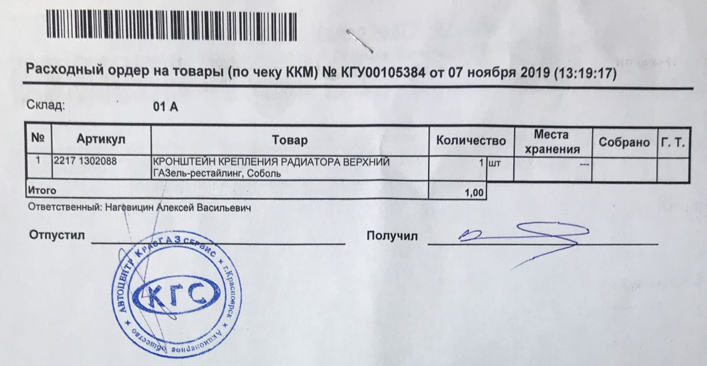
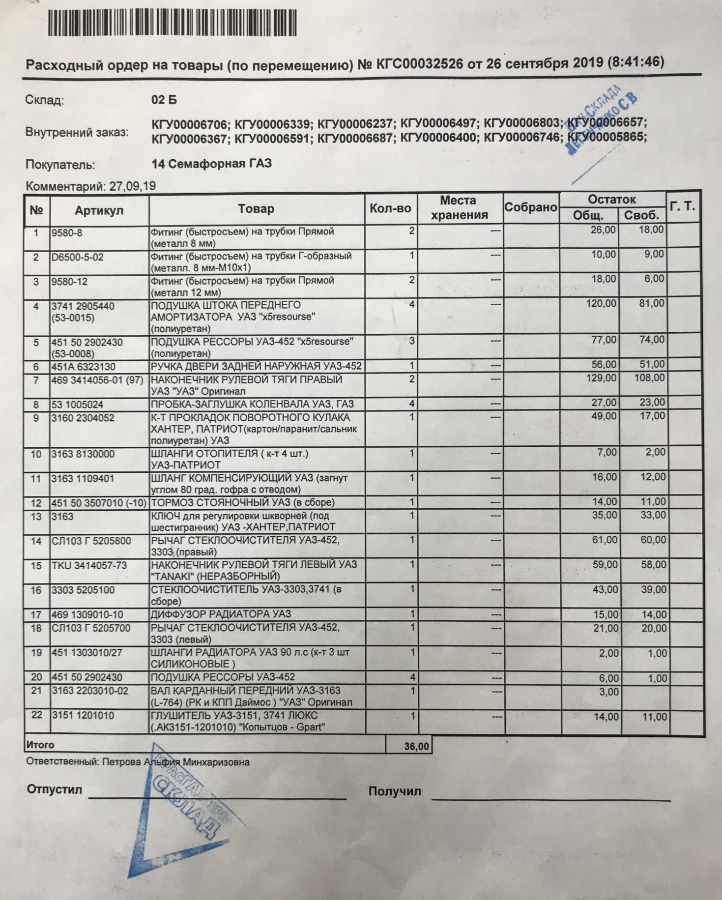
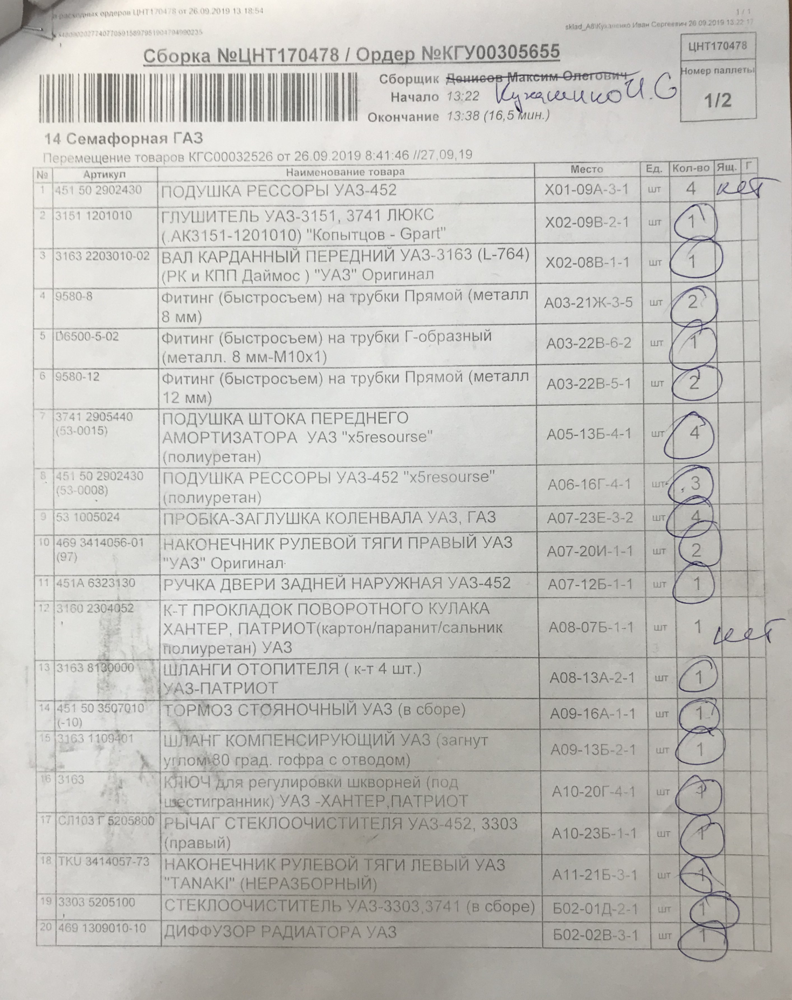

## Отгрузка на складе

Целью процесса отгрузки на складе является обеспечение сохранности количества и качества поставляемой продукции, создание условий для своевременной и правильной приемки ее по качеству, а также правильный, быстрый и своевременный отпуск товара точно в срок.

Общие виды работ, осуществляемые при выполнении этого процесса:
- обработка заказов по наличию товаров на складе;
- отбор товаров с места хранения;
- перемещение товаров в зону комплектования заказов;
- комплектование заказов и упаковка товаров - укладка в тару, формирование тарных мест;
- оформление упаковочных листов, закладка их в тарные места и крепление на грузовых местах;
- закрытие тарных мест;
- маркировка тарных мест;
- загрузка тарных мест на поддоны;
- перемещение поддонов в зону погрузки;
- загрузка контейнеров, почтово-багажного транспорта;
- оформление транспортной накладной.

## Подготовка к комплектованию

Процесс комплектования начинается с подачи заявки. Заявка может быть подана одним из пяти способов:

1) продавец со сбыта от оптовиков и филиалов Красноярского края в виде документа «Расходный ордер на товары (по реализации)» (Приложение А, рисунок А.1), (Приложение А, рисунок А.2) - при безналичном расчете), передает «Расходный ордер на товары (по реализации)» Старшему кладовщику. На основании этого документа в программе 1С УПП формируется в «Расходный ордер» для комплектования.

2) продавец со сбыта по заявке от оптовиков и филиалов Красноярска формирует «Расходный ордер (по перемещению)» (Приложение Б) и передает Учетчику. Перемещение товара производится в программе 1С УПП для оптовиков — на склад «Сбыт», а для филиалов Красноярска — на склад филиала Красноярска.

3) электронная компьютерная обработка по документам «Внутреннего заказа» анализирует проданные товары за предыдущий день, товар в программе 1С УПП переносится Учетчиком с центрального склада на склад «Зона отгрузки» и формируется «Расходный ордер по перемещению» для филиалов Красноярска («Расходный ордер» распечатывает Старший кладовщик).

4) продавец со сбыта по «Заказу поставщику» от ООО «ГАЗавторемонт» формируют «Заказ покупателя» и передает Оператору – учетчику. В программе 1С УПП Оператор-учетчик переносит товар с центрального склада на склад «Зона отгрузки», формирует и распечатывает «Расходный ордер (по перемещению)» для филиалов Красноярского края.

5) продавец со сбыта производит обработку «Заказа покупателя» от филиала Иркутска и передает Учетчику. Товар в программе 1С УПП переносится с центрального склада на склад «Зона отгрузки», формирует и распечатывает «Расходный ордер (по перемещению)» для филиала Иркутск.

На каждом складе Старший кладовщик составляет «План отдела отгрузки» на конкретный день в порядке очереди заказов, учитывая дату отгрузки. В «Плане отдела отгрузки» указаны даты подачи заявки, дату загрузки и название филиалов, указаны ответственные за комплектование сотрудники, очередь комплектования. В течение дня сотрудники заполняют «План отдела отгрузки» данными о комплектовании.

«План отдела отгрузки» хранится в определенном лотке в зоне выдачи.

Комплектовщик, согласно «Плану отдела отгрузки», берет соответствующий «Расходный ордер» для комплектования.

Сотрудники, закрепленные за выдачей, производят комплектование в «Зоне выдачи», и объем работ в «Плане отдела отгрузки» для них соответственно меньше в 4-5 раз, но по завершении работ сотрудник может обратиться к Старшему кладовщику, чтобы взять задание на следующее комплектование, в этом случае Старший кладовщик вручную вносит задание на комплектование в «План отдела отгрузки».

Комплектовщик сканирует «Расходный ордер» и именной бейдж для принятия задания на комплектование в работу, при этом автоматически распечатывается документ «Сборка» (Приложение В).

Комплектовщик оценивает объем работ и выбирает подходящий размер ТМ. Информирует Карщика о необходимости завезти ТМ в зону комплектования. Основная размерная сетка ТМ (длина*ширина*высота):

- стандартный ящик 1,2м*0,8м*0,8м;
- телевизор 0,8м*0,6м*0,8м;
- полутелек 0,8м*0,6м*0,4м.

Карщик транспортирует ТМ в зону комплектования. Комплектовщик на ТМ наклеивает с двух сторон (по длине и по ширине) Адресные ярлыки формата А5 с реквизитами для отгрузки, а именно:

- наименование филиала Красноярска/Красноярского края;
- номер ТМ;
- склад-отправитель;
- дата отгрузки.
 
## Комплектование товара по документу «Сборка»

3.2.1 Комплектовщик производит поиск товара по месту хранения по документу «Сборка», далее идентифицирует товар и оформляет результаты поиска товара в документе «Сборка».

3.2.1.1 В случае, если целостность необходимого для комплектации товара нарушена, или выявлен брак, Комплектовщик информирует об этом Логиста, и, при необходимости, перемещает бракованный товар в ячейку «Брак» (при отборе товара с центрального склада), при этом Комплектовщик редактирует количество товара в документе «Сборка».

3.2.1.2 Если нужный для комплектования товар не обнаружен, информация об этом передается Логистам.

3.2.2 Комплектовщик осуществляет отбор товара по документу «Сборка» и транспортирует его в зону комплектования.

3.2.3 Отобранный товар комплектуется Контроллером в подготовленные тарные места, далее оформляются результаты комплектования в соответствии с Инструкцией _«Оформление результатов комплектования»_.

_Примечание: в процессе комплектования товара учувствуют Комплектовщик и Контроллер. В случаях, когда по каким-либо причинам Контроллера нет на рабочем месте, к комплектации товара в ТМ допускается Комплектовщик._

3.2.4 Комплектовщик запечатывает ТМ для перемещения в зону отгрузки.

3.2.5 Карщик вывозит собранные тарные места для погрузки ТМ Клиенту.

_Примечание: в некоторых случаях Клиенты самостоятельно забирают ТМ._

**3.3 Выдача товара**

3.3.1 Кладовщик производит выдачу товара в соответствии с Инструкцией _«[Выдача товара клиенту на складе](notesorg/Выдача%20товара%20клиенту%20на%20складе.md)»_, далее оформляет гарантийный талон в соответствии с Инструкцией _«[Выдача гарантийного талона](notesorg/Выдача%20гарантийного%20талона.md)»_, а также оформляет результаты выдачи товара в АРМ Сборщика.

_Примечание: гарантийный талон оформляется на определенные группы товаров, данные товары в 1С УПП обведены жирным шрифтом с припиской «Требуется выдача гарантийного талона»._

**3.4 Контроль проведения комплектования**

3.4.1 Контроллер принимает задание на контроль комплектования в работу, сканируя свой именной бейдж

## Приложение А

Рисунок А.1 – «Расходный ордер на товары (по реализации)»

Рисунок А.2 – «Расходный ордер на товары (по чеку ККМ)»

## Приложение Б

Рисунок Б.1 – «Расходный ордер на товары (по реализации)»

## Приложение В

Рисунок В.1 – Документ «Сборка»

[Регламент-Отгрузка на складе.docx](_attach/Регламент%20-%20Отгрузка%20на%20складе.docx)