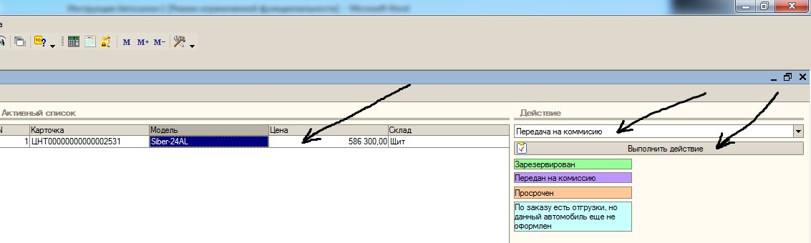
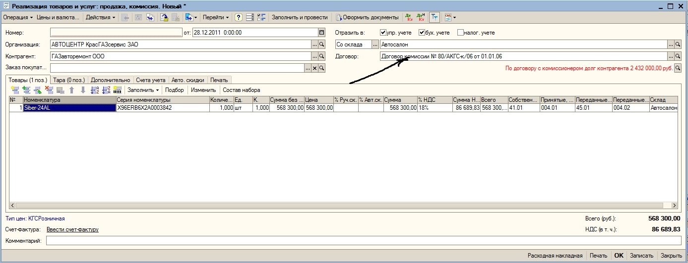
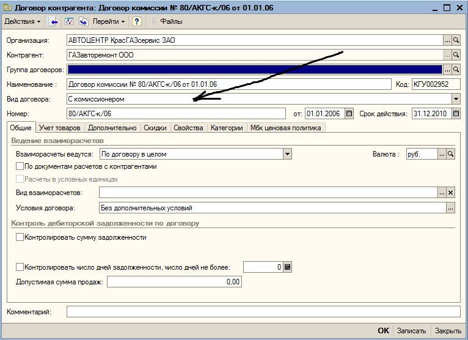
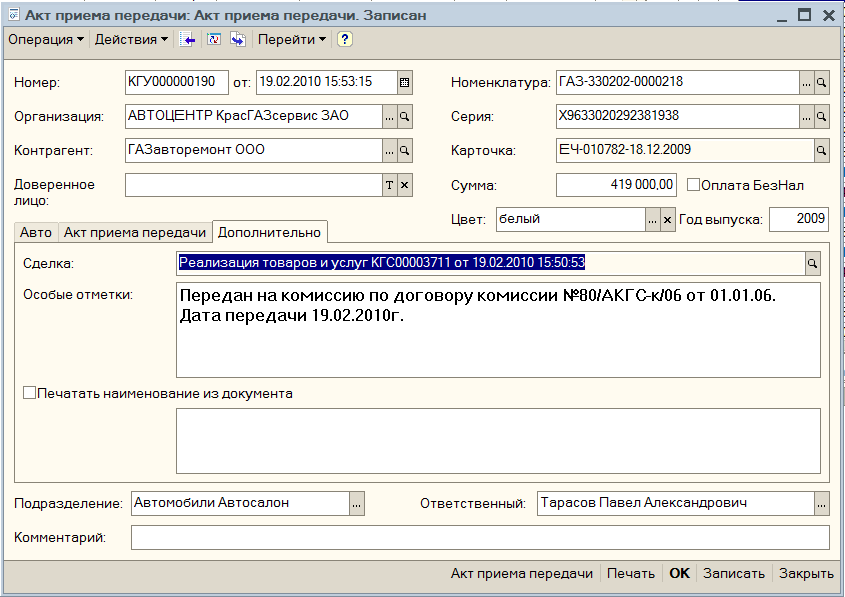
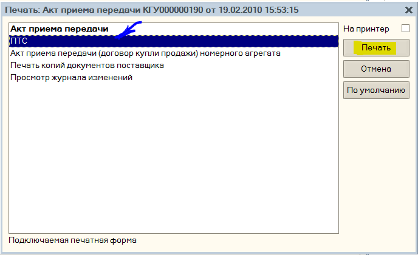
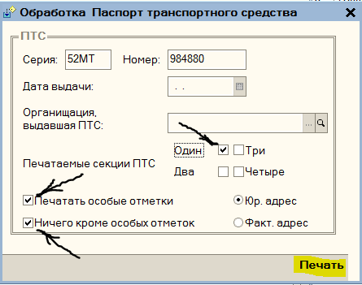
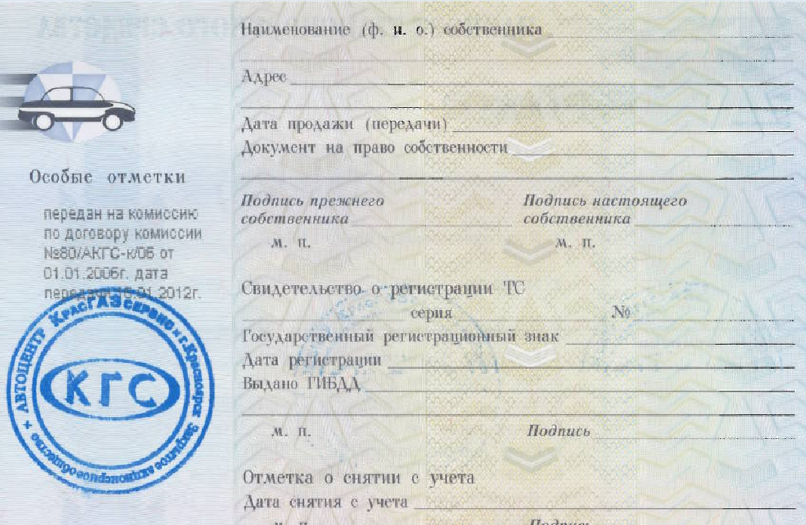

Предварительно на передающийся автомобиль выписывается заказ покупателя. Передача автомобиля (автомобилей) на комиссию осуществляется с помощью обработки «АРМ оформления автомобилей». В блок АРМа «Активный список» помещается необходимые автомобили, в блоке «Действие» выбирается вариант «Передача на комиссию», производится нажатие кнопки «Выполнить действие» (рисунок 79). После чего на экране появляется документ «Реализация товаров и услуг» (рисунок 80).

Рисунок 79. Активация процесса передачи автомобиля на комиссию

Рисунок 80. Документ «Реализация товаров и услуг»

Важной особенностью является то, что в поле «Договор» документа «Реализация товаров и услуг» должен быть помещён именно «комиссионный» договор контрагента. В элементе справочника «Договор контрагента» «комиссионного» договора в поле «Вид договора» должна быть выбрана опция «С комиссионером» (рисунок 81). Счёт-фактура в случае передачи автомобиля на комиссию не регистрируется. После оформления передачи на комиссию автомобильная строка в АРМе оформления автомобилей окрашивается в фиолетовый цвет.

Рисунок 81. Элемент справочника «Договор контрагента»

Распечатка ПТС при передаче автомобиля на комиссию производится следующим образом:

Вводим документ «Акт приема передачи»;

В закладке дополнительно, заполняем поле «Особые отметки»

Записываем документ;
Нажимаем кнопку «Печать»;

Выбираем пункт «ПТС», и нажимаем кнопку «Печать»;  
В открывшейся форме «Обработка Паспорт транспортного средства» устанавлива-

ем галочки «Печатаемые секции ПТС» в зависимости от ситуации секция «Один» или «Два», «Печатать особые отметки», «Ничего кроме особых отметок»;

Нажимает кнопку «Печать».

