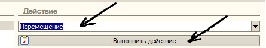
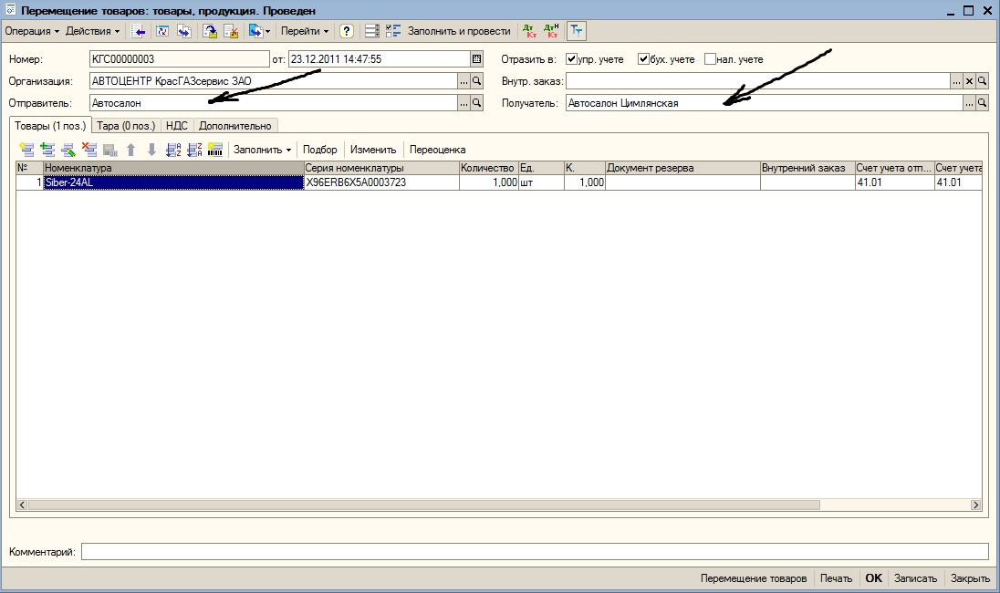
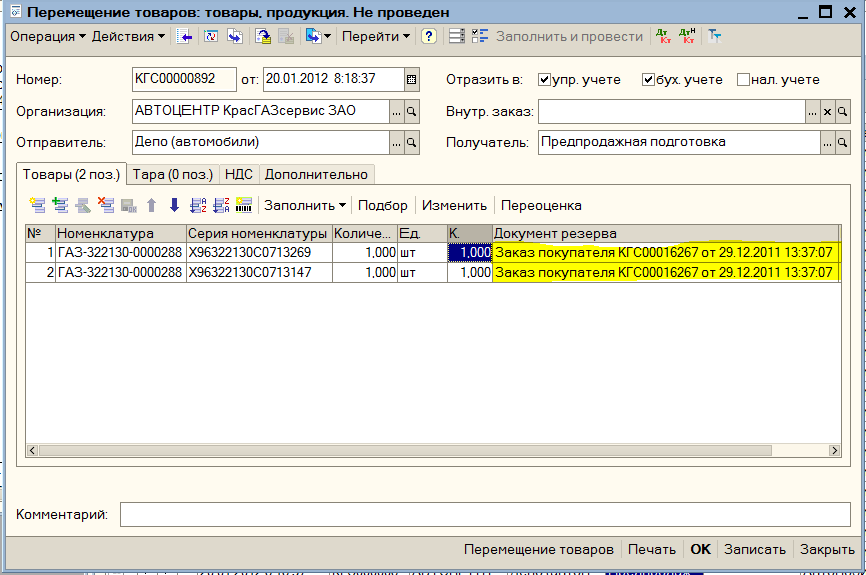

Перемещение автомобилей осуществляется с помощью обработки «АРМ оформления автомобилей». В блок АРМа «Активный список» помещается необходимый автомобиль, в блоке «Действие» выбирается вариант «Перемещение», производится нажатие кнопки «Выполнить действие» (рисунок 28). После чего на экране появляется документ «Перемещение товаров». После выбора склада-отправителя и склада получателя (рисунок 29) документ «проводится» и закрывается. В АРМе после обновления в обрабатываемой строке автомобиля появляется новое место хранения (склад).

Рисунок 28. Выбор варианта «Перемещение», кнопка «Выполнить действие»

Рисунок 29. Документ «Перемещение товаров»

Если необходимо переместить автомобиль на который оформлен заказ покупателя выполняем следующие действия:

В поле «Документ резерва» табличной части обязательно выбираем документ «Заказ покупателя» по которому данный автомобиль зарезервирован на складе.

