Поступление автомобилей оформляется с помощью документа «Поступление товаров и услуг. На рисунке 1 показано меню выбора документа.

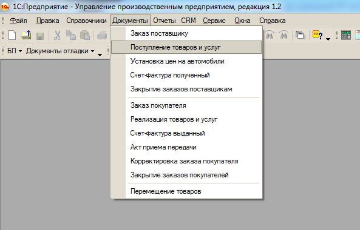

Рисунок 1. Меню выбора документа «Поступление товаров и услуг»

Для корректного подбора автомобилей в документ используется обработка «Создание карточек». Обработка активизируется путём нажатия в документе кнопки «Заполнить» и активизации кнопки обработки (рисунок 2).

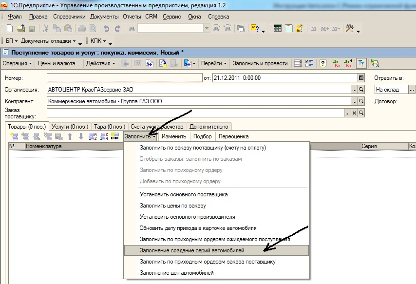

Рисунок 2. Кнопка вызова обработки «Создание карточек»

На рисунке 3 представлен внешний вид обработки «Создание карточек».

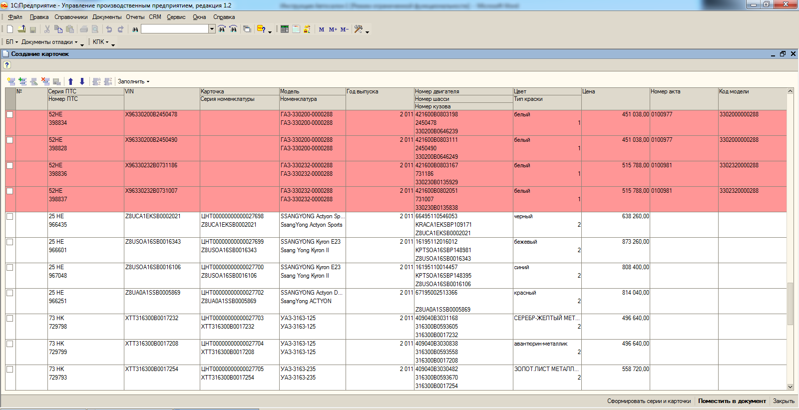

Рисунок 3. Обработка «Создание карточек»

Загрузка может производиться из файла поставщика автомобилей (автомобили отгруженные). В этом случае используются кнопки «Заполнить» - «Добавить из файла DBF» (рисунок 4). В этом случае после выбора файла поставщика информация по автомобилям появится в таблице обработки. На рисунке 3 эта информация выделена розовым цветом. По ещё не поступившим автомобилей остаются незаполненные поля «Карточка» и «Серия номенклатуры».

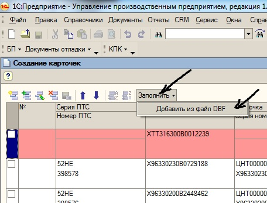

Рисунок 4. Кнопки «Заполнить» - «Добавить из файла DBF»

Возможно ручное добавление информации по автомобилю в строку обработки «Создание карточек». Для этого используется кнопка «Добавить» (рисунок 5). После нажатия, которой появляется пустая розовая строка обработки, заполняемая вручную (рисунок 6). Поля «Карточка» и «Серия номенклатуры» на этапе первоначального заполнения остаются пустыми.

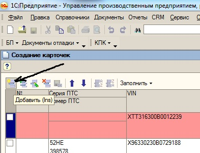

Рисунок 5. Кнопка «Добавить»

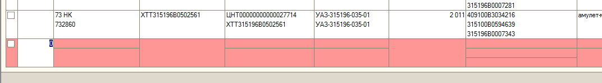

Рисунок 6. Строка обработки

При поступлении автомобилей на склад заполнение полей «Карточка» и «Серия номенклатуры» производится в следующем порядке. Необходимые строки автомобилей помечаются «флагом» после чего производится нажатие кнопки «Сформировать серии и карточки» (рисунок 7).

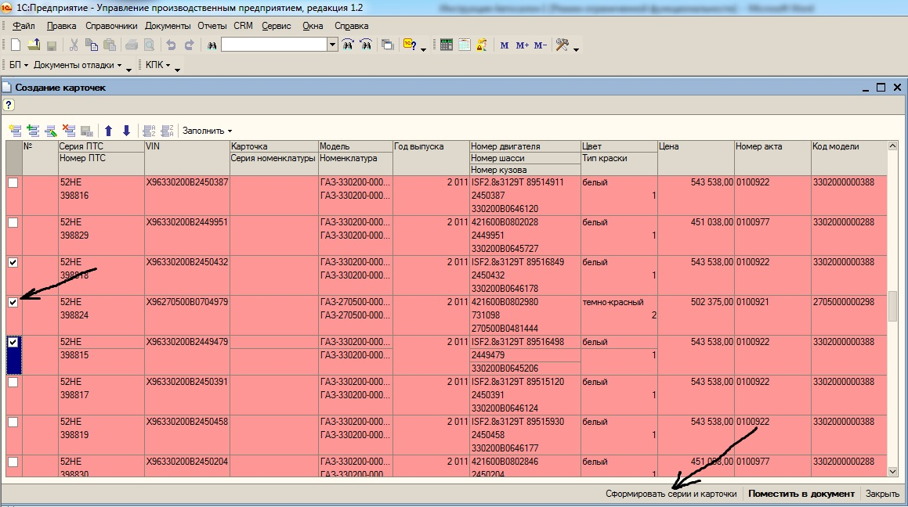

Рисунок 7. Пометка строки автомобиля «флагом», кнопка «Сформировать серии и карточки»

После нажатия кнопки «Сформировать серии и карточки» строка из розовой превращается в белую, в полях «Карточка» и «Серия номенклатуры» появляется необходимая информация (рисунок 8). При необходимости любую строку обработки можно удалить после активизации её курсором и нажатием клавиши «delete».

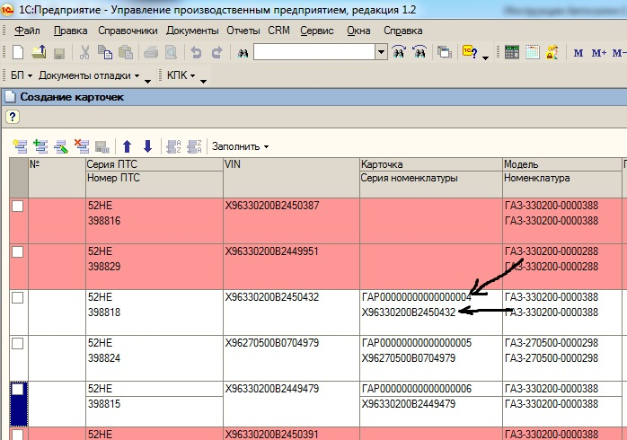

Рисунок 8. Информация в полях «Карточка» и «Серия номенклатуры»

Для переноса информации о необходимых автомобилях в документ «Поступление товаров и услуг» необходимые строки обработки (белого цвета) выделяют «флагом» после чего производится нажатие на кнопку «Переместить в документ» (рисунок 9).

Рисунок 9. Пометка строки автомобиля «флагом», кнопка «Переместить в документ»

После нажатия на кнопку «Переместить в документ» в строках документа «Поступление товаров и услуг» (рисунок 10) появляется информация об автомобиле, остаётся лишь внести информация о необходимом складе хранения, проверить регистрацию необходимого типа закупочных цен (кнопка «Цены и валюты»), заполнить Закладку «Дополнительно» внесением номера и даты товарной накладной поставщика, и провести документ. Хочется отметить, что после перенесения информации об автомобили из строки обработки «Создание карточек» эта строка подлежит удалению (для исключения дублирования информации при последующих переносах).

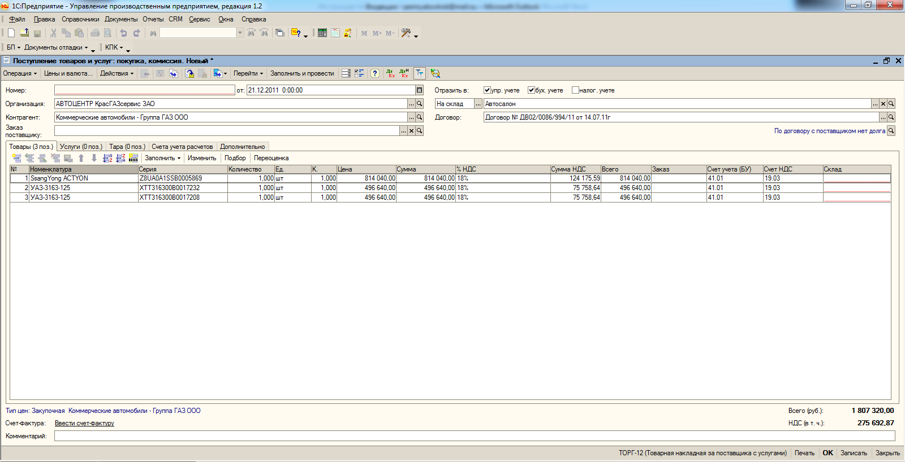

Рисунок 10. Документ «Поступление товаров и услуг»

После этого с помощью кнопки «Ввести счёт-фактуру» (рисунок 11) производится регистрация счёта-фактуры.

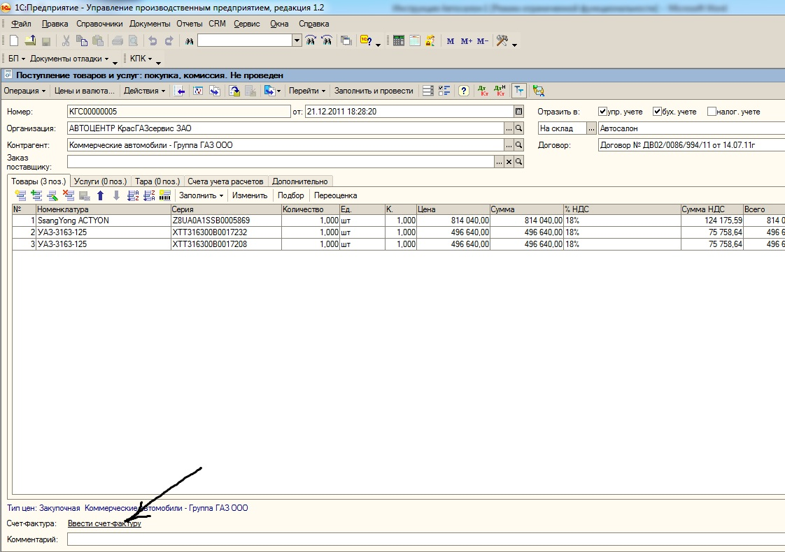

Рисунок 11. Кнопка «Ввести счёт-фактуру»

После нажатия кнопки «Ввести счёт-фактуру» на экране появится форма счёта-фактуры, в которую необходимо внести данные о реквизитах счёта-фактуры поставщика (номер и дата) после чего «провести» документ (рисунок 12).

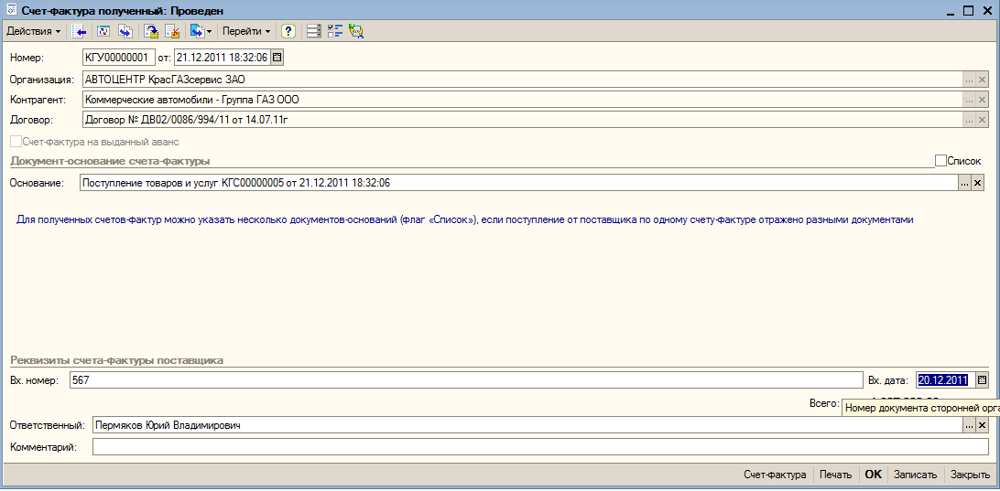

Рисунок 12. Документ «Счёт-фактура»

Особенностью поставки автомобилей от некоторых поставщиков-производителей (передача автомобиля в собственность ЗАО «Автоцентр КрасГАЗсервис» осуществляется только после подтверждения оплаты покупателя автомобиля). В этом случае на первом этапе регистрации используется не документ «Поступление товаров и услуг», а «Приходный ордер на товары». Для работы с документом необходимо переключить интерфейс (рисунок 13) последовательно выбирая кнопки «Сервис», «Переключить интерфейс», «Полный».

Рисунок 13. Кнопки «Сервис», «Переключить интерфейс», «Полный»

В интерфейсе «Полный» находим путь к документу «Приходный ордер на товары» (рисунок 14) последовательно выбирая кнопки «Документы», «Управление запасами», «Приходный ордер на товары».

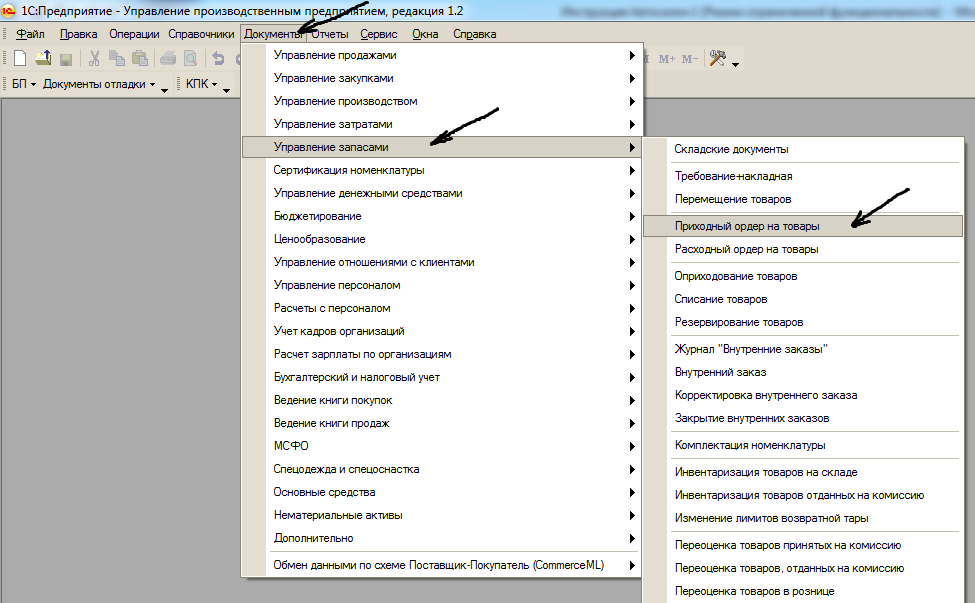

Рисунок 14. Кнопки «Документы», «Управление запасами», «Приходный ордер на товары»

На рисунке 15 представлен внешний вид документа «Приходный ордер на товары», заполнение которого также производится с помощью обработки «Создание карточек». Обработка вызывается при помощи кнопок «Заполнить» и «Заполнение создание серий автомобилей».

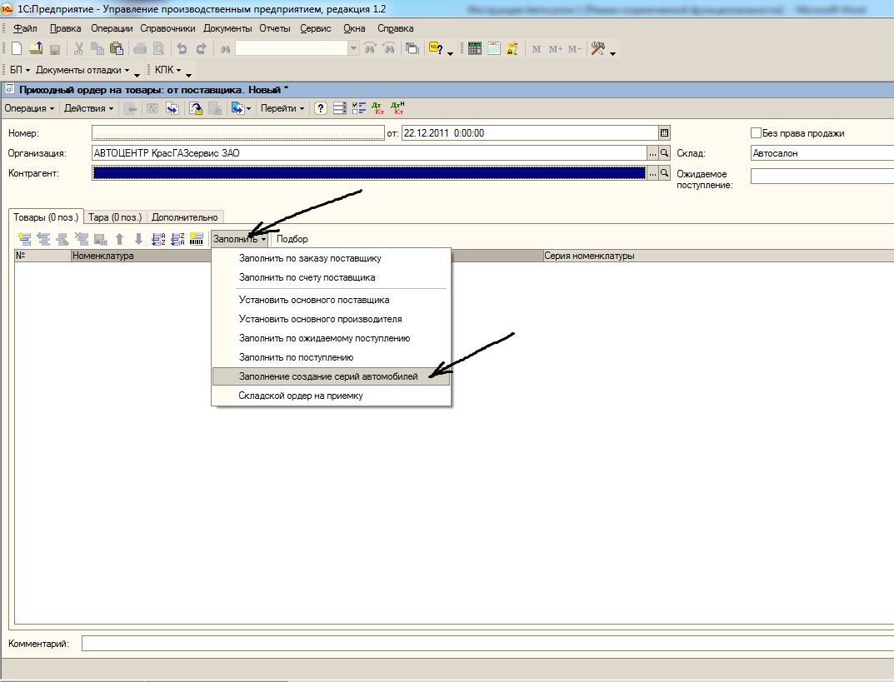

Рисунок 15. Кнопки «Заполнить» и «Заполнение создание серий автомобилей»

Работа с обработкой «Создание карточек» для заполнения документа «Приходный ордер на товары» производится так же, как и при заполнении документа «Поступление товаров и услуг» (смотри пример выше).

На рисунке 16 представлено изображение полностью подготовленного документа «Приходный ордер на товары». Хочется отметить, что в поле документа «Без права продажи» «флаг» должен отсутствовать.

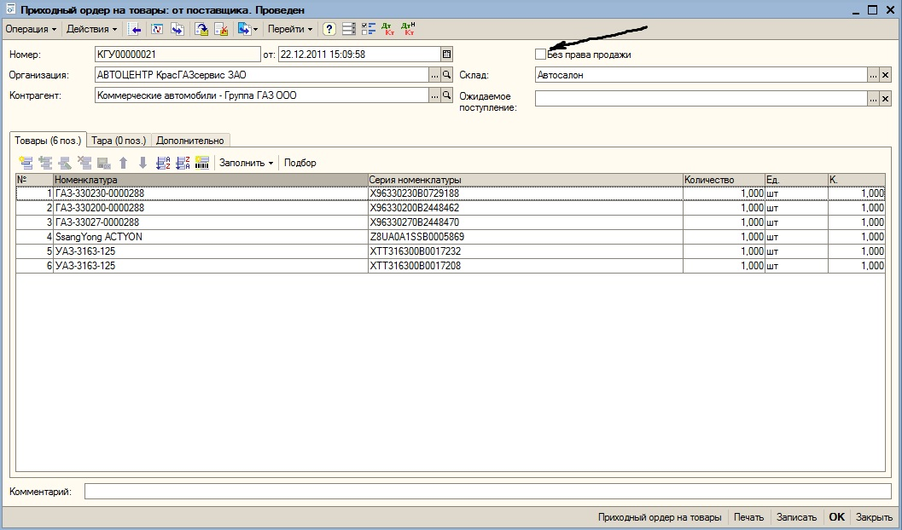

Рисунок 16. Документ «Приходный ордер на товары»

После разрешения предприятия-изготовителя на продажу автомобиля на основании документа «Приходный ордер на товары» в информационной системе регистрируется документ «Поступление товаров и услуг» (рисунок 17). Перед вводом документа «Поступление товаров и услуг», необходимо убедится в том, что поступление уже не сформировано - для этого в документе приходный ордер нажимаем кнопку «Перейти»- «Структура подчиненности документа». Если документ уже сформирован-то он отразится в структуре подчиненности и вводить его не нужно. Иначе - вводим документ.

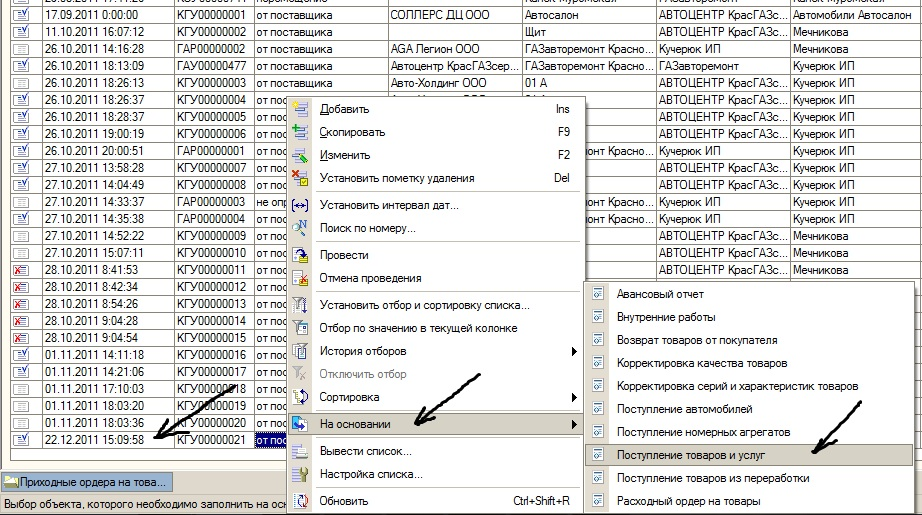

Рисунок 17. Ввод на основании документа «Приходный ордер на товары» документа «Поступление товаров и услуг»

На рисунке 18 показан внешний вид документа «Поступление товаров и услуг» созданный на основании документа «Приходный ордер на товары». Документ «Счёт-фактура» регистрируется аналогично примера приведённого выше.

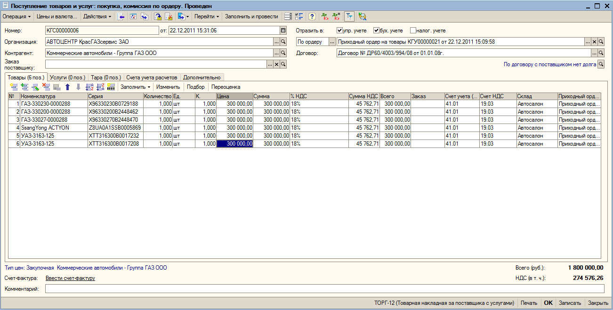

Рисунок 18. Документ «Поступление товаров и услуг»