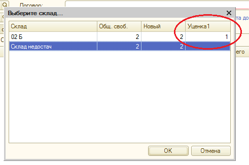
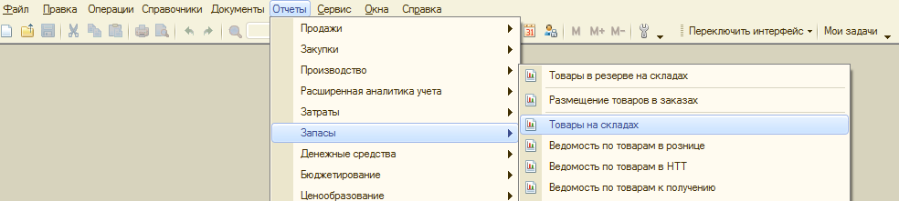
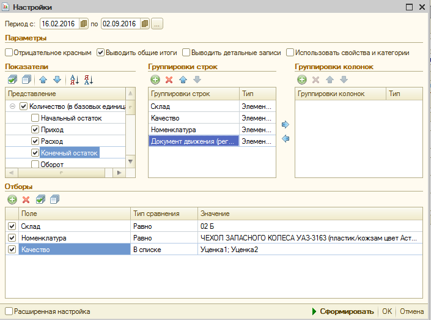
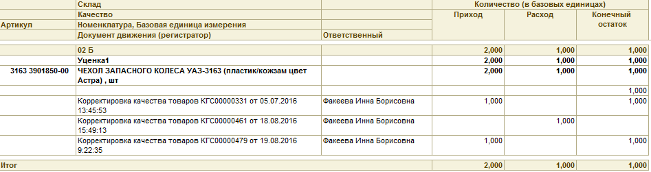
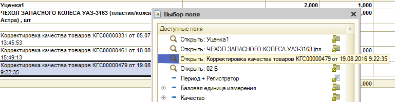
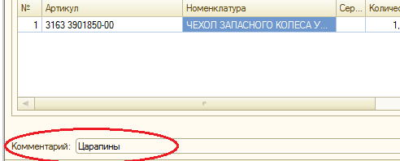
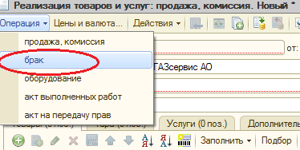

## Инструкция по реализации товаров с качеством отличным от «Новый»

На складе имеется товар с качествами, отличными от «Новый», а именно: «Брак», «Уценка 1», «Уценка 2», «Утиль», «Ремонт» и др.

К реализации допускаются товары с качествами «Уценка 1» и «Уценка 2».

При этом, качество «Уценка 1» подразумевает незначительную потерю товаром потребительских свойств и снижение его розничной стоимости на 35%; качество «Уценка 2» подразумевает существенную потерю товаром потребительских свойств и снижение его стоимости на 65% от розничной цены.

**Запрещены продажи данных товаров по дисконтным картам и по договорам с ценовой политикой!**

Не допускаются к реализации товары с дефектами, являющиеся составными частями рулевых и тормозных механизмов!

**Процесс поиска товара с качеством отличным от «Новый»:**

Продавцы на местах имеют возможность видеть в учетной системе товары в разрезе остатков товаров на складах, а также в разрезе качеств товаров.

Поиск и отображение осуществляется привычным способом в окне «Подбор» любого из документов, подразумевающих расход товара со склада («Реализация товаров и услуг», «Чек ККМ», «Перемещение товаров» и пр.)

Рис. 1. Окно подбора номенклатуры в документе «Реализация товаров и услуг»

При этом, для качеств товаров, отличных от «Новый», добавились колонки: Брак, Уценка 1, Уценка 2, Ремонт, Утиль.

Поиск также можно осуществить, сформировав отчет «Товары на складах» во вкладке «Запасы»:

Для корректного отображения движения товаров по складам, в настройках отчета требуется задать достаточно большой временной интервал (например, период с 16.02.2016 (это время создания отдельной зоны склада «Брак») - по текущую дату), убедиться, что стоят «галочки» в разделах Количество (в базовых единицах), Приход, Расход, Конечный остаток. Группировка строк должна быть следующая: Склад (Тип: Элемент), Качество (Тип: Элемент), Номенклатура (Тип: Элемент), Документ движения (регистратор) (Тип: Элемент). Последовательность пунктов также важна! Достигается добавлением нового пункта (значок Добавить «плюс в зеленом кружке») и перемещением вверх/вниз (синими стрелками). В «Отборах» устанавливаем «галочку» для Поля Склад и из списка выбираем склад «02Б», для поля Номенклатура также ставим «галочку», тип сравнения «равно» (для одного элемента номенклатуры в отдельности) и в подборе выбираем требуемую номенклатурную единицу, значком «плюс» добавляем новую строку - «Качество» - тип сравнения «В списке» - Значение «Уценка 1» и «Уценка 2».

После того, как все настройки выполнены, нажимаем кнопку «Сформировать».

Сформируется отчет, содержащий информацию о движении товара на складе с указанием документов, которыми были введены те или иные изменения (изменено количество товара, его качество и т. д.)

Из примера видно, что последнее поступление товара на склад с требуемым качеством («Уценка 1») было выполнено документом «Корректировка качества товаров КГС00000479».

Есть возможность перейти в указанный документ, чтобы увидеть причину изменения качества товара. Для этого дважды щелкаем левой кнопкой мыши по полю «Корректировка качества товаров КГС00000479...» и нажимаем «Открыть: Корректировка качества товаров КГС00000479 от 19.08.2016 9:22:35»

В открывшемся документе в строке «Комментарий» содержится пояснение (описание дефекта) почему товар переведен в категорию уцененных товаров.

В случае, если описания недостаточно, и клиенту требуется осмотреть товар до его покупки, следует запустить бизнес-процесс «[[notesorg\Дайте посмотреть]]».

Продажа уцененного товара возможна только документом «Реализация товаров и услуг».

(!) Важное отличие: во вкладке «Операции» необходимо выбрать строку «брак». Вне зависимости от того, что реализуется товар с качествами «Уценка 1» и «Уценка 2», документ будет называться «Реализация товаров и услуг: брак»

  

  

  

  

  

  

  

  

  

  

Контрагентом (если нет другого) будет выступать «Частное лицо (масла)» (код МЕЧ-00017124).

  

  

  

  

  

  

  

Важно: документом «Реализация товаров и услуг: брак» возможно реализовать только товары с качествами «Уценка 1» и «Уценка 2», также как документом «Реализация товаров и услуг: продажа, комиссия» возможно реализовывать только товары с качеством «Новый». Поэтому, если один клиент приобретает товары с разными качествами («Новый» + «Уценка 1» и/или «Уценка 2»), требуется оформить два разных документа.

  

  

После этого подбираем товар в табличную форму документа привычным способом.

  

  

Обратите внимание, в табличную часть документа добавилась колонка «Качество», которой не было в документе «Реализация товаров и услуг: продажа, комиссия». По умолчанию эта колонка не заполнена, ее надо заполнить, выбрав качество товара из справочника

  

  

  

После того, как в соответствующей колонке будет установлено корректное качество товара, автоматически заполнится поле со значением скидки, и пересчитается итоговая сумма товара.

  

  

Печатная форма для документа «Реализация товаров и услуг: брак» - «Товарная накладная» - единая для всех покупателей, вне зависимости от того, является ли покупатель частным лицом, или юридическим. «Товарная накладная» дополнена секцией с информацией для покупателя о том, что приобретается бракованный товар. Обязательно распечатать «Товарную накладную» в двух экземплярах (один — для клиента, другой остается у продавца). Вручную заполнить описание дефекта товара по информации из документа «Корректировка качества товаров» (комментарий к документу). Ознакомить клиента под роспись в двух экземплярах.

  

  

Конец
