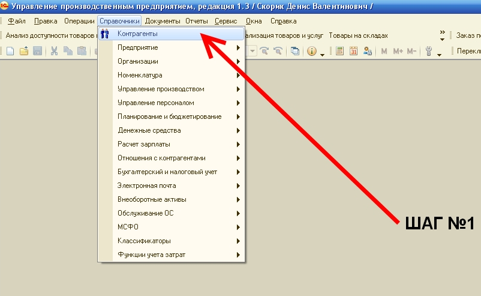
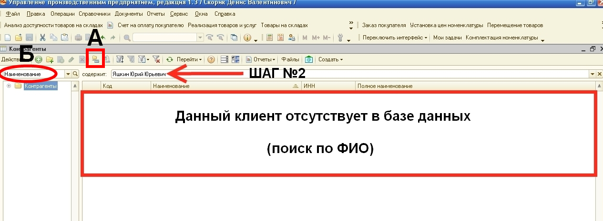
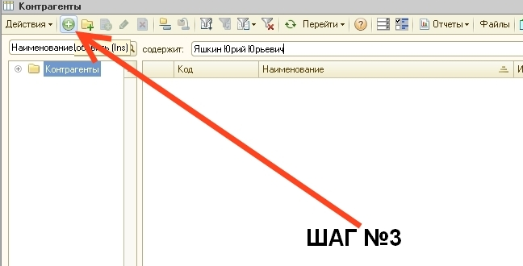
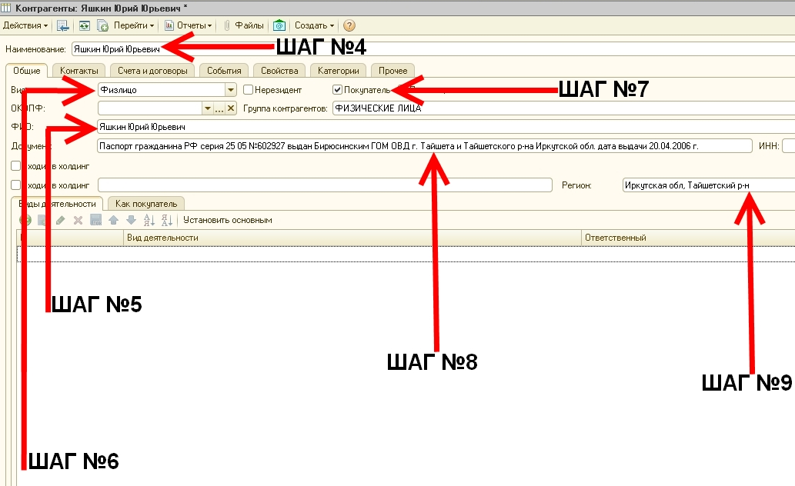
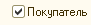
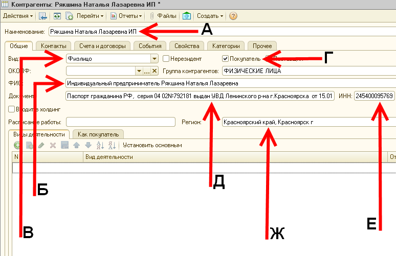
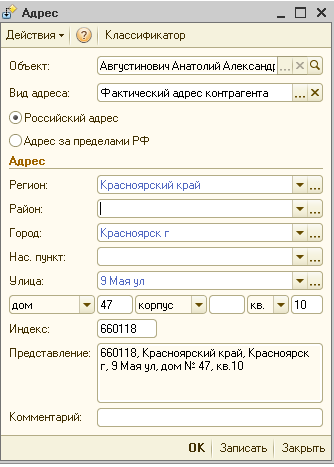
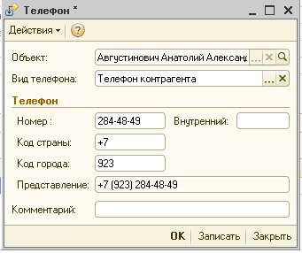
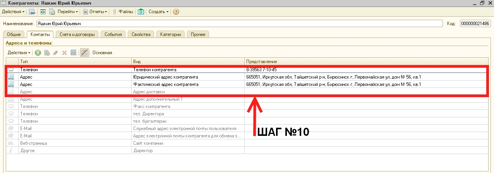

## ПОШАГОВАЯ ИНСТРУКЦИЯ ВВОДА НОВОГО КОНТРАГЕНТА

**ДЛЯ ФИЗИЧЕСКИХ ЛИЦ и ИНДИВИДУАЛЬНЫХ ПРЕДПРИНИМАТЕЛЕЙ (ПОКУПАТЕЛИ)**

1.  ШАГ **№1** _выбираем пункт_ **«Контрагенты»**

2.  Шаг **№2** _поиск контрагента по_ **«НАИМЕНОВАНИЮ»**
	-   **«А»** _отключаем иерархию_ 
	- **«Б»** _ставим сортировку по_ 
	- Убедившись в отсутствии данного контрагента в базе данных 1С по **«Наименованию»** переходим к ШАГУ **№3**
  
  

> **! ПЕРЕД ВВОДОМ НОВОГО КОНТРАГЕНТА ОБЯЗАТЕЛЬНО ПРОВЕРИТЬ НАЛИЧИЕ ЕГО В БАЗЕ ДАННЫХ 1С !** 

3.  ШАГ **№3** _Добавляем нового контрагента_
		_Для ввода нового контрагента_ _нажимаем кнопку_  **«Добавить»** _или клавишу на клавиатуре персонального компьютера_ **«Insert»**

4.  ШАГ **№4,5,6,7,8,9** _заполняем поля_

## ВАРИАНТ «I» для физических лиц

**а.** ШАГ №4 **«Наименование»** _вводим_ **ФИО** **!** _в именительном падеже_ _полностью_**!** **(ОБЯЗАТЕЛЬНО)** Пример: Иванов Иван Иванович

**б**. ШАГ **№5** ФИО _заполняется автоматически_ **(ОБЯЗАТЕЛЬНО)**

**в.** ШАГ **№6** _выставляем_ **«Вид»** **(ОБЯЗАТЕЛЬНО)** 

**г.** ШАГ **№7** ставим «галочку» **(ОБЯЗАТЕЛЬНО)** 

**д.** ШАГ **№8** _заполняем паспортные данные_ **(ОБЯЗАТЕЛЬНО)** 

> **Пример:   
> Паспорт гражданина РФ серия 25 05 №602927 выдан Бирюсинским ГОМ ОВД г.Тайшета и Тайшетского р-на Иркутской обл. дата выдачи 20.04.2006 г.**_

**е.** ШАГ **№9** выбираем «**Регион»**, в котором зарегистрирован контрагент **(ОБЯЗАТЕЛЬНО)**

## **ВАРИАНТ** «II» для Индивидуальных предпринимателей

**А.** **«Наименование»** _вводим_ **ФИО** **!** _в именительном падеже полностью,_ _после_ **ФИО** _вводим без кавычек, скобок и т.п._ **ИП****!** **(ОБЯЗАТЕЛЬНО)** Пример: Иванов Иван Иванович ИП

**Б.** _вводим_ Индивидуальный предприниматель далее ФИО **без кавычек, скобок и т.п.** **(ОБЯЗАТЕЛЬНО)** Пример: Индивидуальный предприниматель Иванов Иван Иванович

**В.** _выставляем_ **«Вид»** **(ОБЯЗАТЕЛЬНО)**   
**Г.** _ставим_ «галочку» **(ОБЯЗАТЕЛЬНО)**   
**Д.** _заполняем паспортные данные_ **(ОБЯЗАТЕЛЬНО)** 

>_**Пример:  
>Паспорт гражданина РФ серия 25 05 №602927 выдан Бирюсинским ГОМ ОВД г.Тайшета и Тайшетского р-на Иркутской обл. дата выдачи 20.04.2006 г.**_

**Е.** _вводим_ «**ИНН»** _контрагента_ **(ОБЯЗАТЕЛЬНО)**

> _**! "ИНН" Индивидуального предпринимателя состоит из 12-ти цифр !  
> Пример:245400095769**_

**Ж.** _выбираем_ «**Регион»**, _в котором зарегистрирован контрагент_ **(ОБЯЗАТЕЛЬНО)**

5.  ШАГ **№10** _заполняем поля_ **«Контакты»**
	**а.** _вводим_ **«Фактический адрес»** **(ОБЯЗАТЕЛЬНО)** _**Пример: 660118, Красноярский край, Красноярск г., 9 Мая ул., дом №47 кв.10**_

	_После заполнения данных полей для записи элемента следует нажать кнопку «Записать», расположенную в правом нижнем углу._
  
	**б.** _вводим_ **«Телефон контрагента» (ОБЯЗАТЕЛЬНО)** 

> _**Пример:**_  

 
_После заполнения данных полей для записи элемента следует нажать кнопку «Записать», расположенную в правом нижнем углу._

