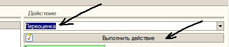
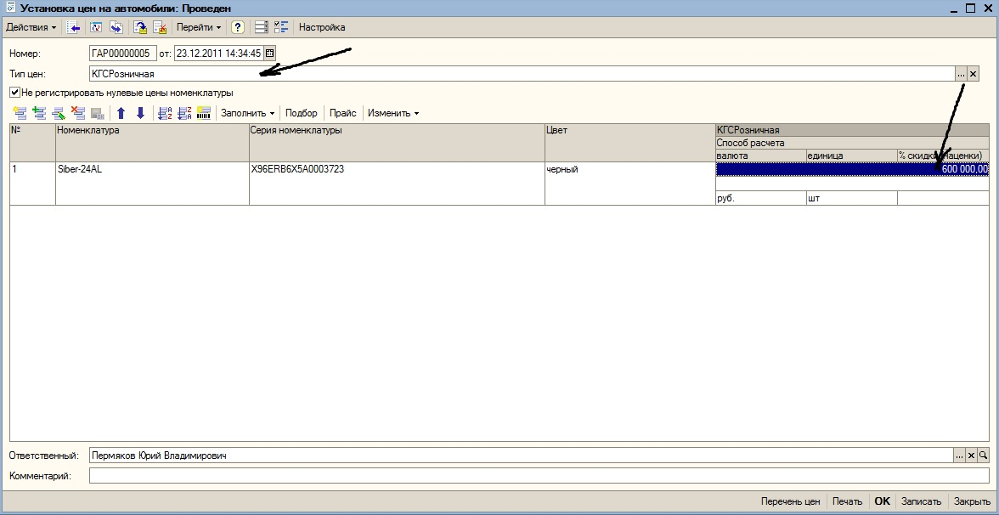

Первоначальная установка цены продажи, а также переоценка производится с использованием автоматизированного рабочего места («АРМ оформления автомобилей»). В блок АРМа «Активный список» помещается необходимый автомобиль, в блоке «Действие» выбирается вариант «Переоценка», производится нажатие кнопки «Выполнить действие» (рисунок 26). После чего на экране появляется документ «Установка цен на автомобили». В документе выбирается необходимый тип цен, как правило, это «КГСРозничная», вводится необходимая цена (рисунок 27), после чего документ «проводится» и закрывается. В АРМе после обновления в обрабатываемой строке автомобиля появляется выбранная цена продажи.

Рисунок 26. Выбор варианта «Переоценка», кнопка «Выполнить действие»

Рисунок 27. Документ «Установка цен на автомобили»